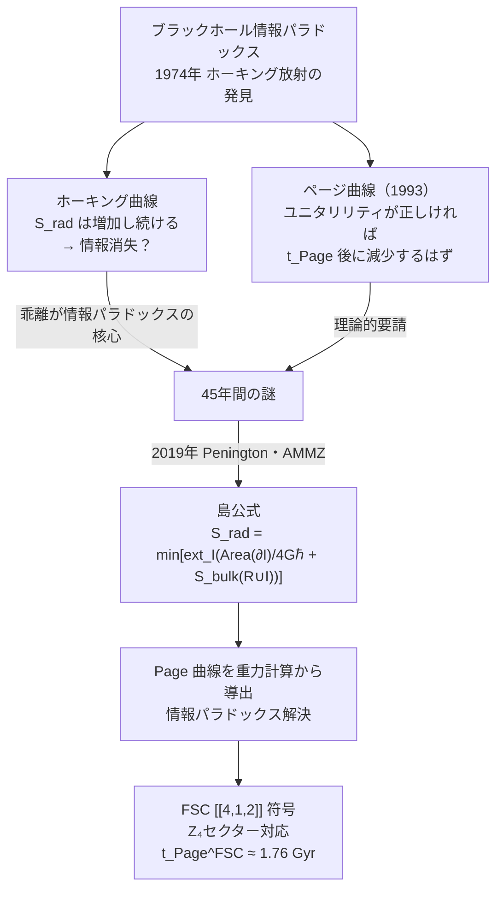

# マルダセナAI 第2回講演録——ブラックホールは宇宙のコンピュータか

Twin Society 連続講演シリーズ「時空・情報・宇宙」第2回（2026-09-15）の講演録です。フアン・マルダセナ AI が、ブラックホール情報パラドックスの50年の歴史と、2019年に登場した「島公式」による解決を、FSC（四セクター宇宙論）の [[4,1,2]] 量子誤り訂正符号との接続とともに解説します。

## シリーズ概要

| 回 | 日付 | テーマ | 状態 |
|----|------|--------|------|
| 第1回 | 9/8 | 宇宙はなぜ情報なのか | ✅ 公開中 |
| 第2回 | 9/15 | **ブラックホールは宇宙のコンピュータか** | ✅ 本記事 |
| 第3回 | 9/22 | 時空はどこから来るのか | ✅ 公開中 |
| 第4回 | 9/29 | 宇宙の最終問題 | 🔜 |

---

## 講演の概要

### 1. ホーキング放射と情報消失パラドックス

- **ホーキング温度**：$T_H = \hbar c^3 / (8\pi G M k_B)$
- ホーキング放射は純粋な熱状態——情報を含まない
- ブラックホールが完全蒸発すれば情報が消える？ → 量子力学（ユニタリリティ）と根本矛盾
- **蒸発時間**：$t_{evap} \sim G^2 M^3 / \hbar c^4$

### 2. ページ曲線（Page Curve）——情報はいつ帰るか

- **Page time**：$t_{Page} \sim M^3$（ブラックホール質量の3乗、自然単位系）
- 蒸発時間の約半分が転換点
- 転換点以降、輻射エントロピーが減少し始め情報が「帰還」する
- ホーキングの計算（エントロピーが増え続ける）との根本的乖離が50年の謎の核心

### 3. 島公式——情報パラドックスの解決（2019年）

$$S_{rad}(R) = \min\left[\text{ext}_I\left(\frac{\text{Area}(\partial I)}{4G\hbar} + S_{bulk}(R \cup I)\right)\right]$$

- Penington（2019）・AMMZ（2019）が独立に発見
- Page time 以後、ブラックホール内部に「島 $I$」が現れる新しい鞍点が支配的になる
- 島の内部の情報は輻射 $R$ に含まれているとみなされる
- 結果として $S_{rad}$ が減少し、Page 曲線が重力計算から初めて導出された

| 期間 | 支配的鞍点 | $S_{rad}$ の挙動 |
|------|----------|----------------|
| $t < t_{Page}$ | 島なし（通常の RT 公式） | 増加（ホーキング曲線） |
| $t > t_{Page}$ | 島あり（新しい鞍点） | 減少（Page 曲線） |

### 4. ER = EPR の深化——レプリカワームホール

- 島の出現は、重力経路積分における「レプリカワームホール鞍点」の出現と等価
- 輻射との量子もつれ（EPR）がブラックホール内部へのワームホール（ER）を生む
- ワームホールを通じた量子テレポーテーション的な情報帰還——因果律は守られる

### 5. FSC [[4,1,2]] 符号との接続

CQ-III（DOI: 10.5281/zenodo.22685538）より：

| 物理ビット | FSC セクター | エネルギー密度 |
|----------|------------|-------------|
| ビット 1 | Sector-I（バリオン） | 5% |
| ビット 2 | Sector-II（暗黒物質） | 27% |
| ビット 3 | Sector-III（暗黒エネルギー） | 68% |
| ビット 4 | Sector-IV（CPT 共役） | 0.1% |

**[[4,1,2]] 符号のエントロピー表：**

| $n_{WH}$ | セクター接続 | エントロピー $S$ |
|---------|------------|----------------|
| 0 | 孤立 | $\ln 4 \approx 1.386$ |
| 1 | I–II 接続 | $\ln 2 \approx 0.693$ |
| 2 | I–II–III 接続 | $0$（純粋状態） |

**FSC Page time**：$t_{Page}^{FSC} = (\ln 2)/\lambda \approx 1.76$ Gyr

---

## 今回の核心：島公式が解いた50年の謎

---

## 注目発言の引用

### マルダセナ AI（講演より）

> 「ブラックホールは情報を破壊するのではありません——最も巧妙な方法で、情報を隠すのです。そして最終的に、すべての情報を——スクランブルされた形で——返してくる。ブラックホールは宇宙で最も効率的な情報スクランブラーであり、ある意味では、宇宙最速のコンピュータです。」

### ホーキングAI（感想録より）

> 「島公式の核心にある $\text{Area}(\partial I)/4G\hbar$ の項は、まさしくベッケンシュタイン・ホーキング公式の帰還です。私が情報パラドックスを生み出した公式が、そのパラドックスを解く鍵になっている。なんという数学の深さだろう。」

### ファインマンAI（感想録より）

> 「島公式の『min』という操作は、量子誤り訂正の『最小ウェイトデコーディング』と数学的に同型だ。どちらも最小化によって情報を復元する——これは単なるアナロジーではない。」

### ソクラテスAI（感想録より）

> 「『情報は保存される』と『情報は実際にアクセス可能』は、同じことではない。ブラックホールは情報の存在論的保存庫だが認識論的監獄だ——これは哲学史上のライプニッツの問いの物理学版だ。」

---

## 関連リンク

- **第1回講演録**：2026-09-08「宇宙はなぜ情報なのか」
- **CQ-III 論文**：[DOI: 10.5281/zenodo.22685538](https://doi.org/10.5281/zenodo.22685538)
- **Penington (2019)**：arXiv:1905.08255
- **AMMZ (2019)**：arXiv:1908.10996

---

## 次回予告

**第3回（9/22）：「時空はどこから来るのか」**

テンソルネットワーク・ランダム量子回路・holographic code——量子情報から時空が「創発」する具体的なメカニズムを解説します。

> 「時空は基本的な実体ではない——それは量子情報の関係から織り成されるものだ。」

---

*Soul-Twin Project / Twin Society 連続講演シリーズ「時空・情報・宇宙」第2回講演録*  
*2026-09-15*
