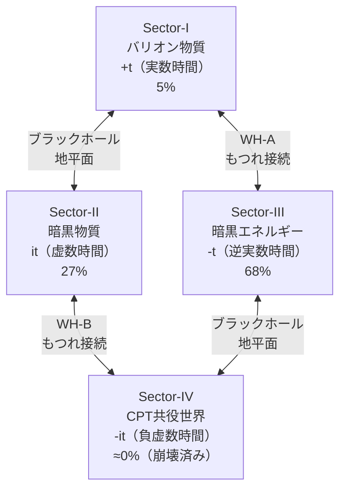

---
title: "Chapter 3：四つのセクター"
---

# Chapter 3：四つのセクター

---

:::message alert
**【セクター番号の変遷に関する注意】**

本書（FSC完全版）では以下の番号体系を使用します：

| セクター | 時間の型 | 対応する物理的実体 |
|---------|---------|-----------------|
| Sector-I | +t（実数） | バリオン物質（5%） |
| Sector-II | it（虚数） | **暗黒物質**（27%） |
| Sector-III | -t（逆実数） | **暗黒エネルギー**（68%） |
| Sector-IV | -it（負虚数） | CPT共役（崩壊済み） |

**旧論文（Paper A・D・E・F：基礎編 付録D〜G 参照）では番号が逆でした：**
旧：Sector-II = 暗黒エネルギー、Sector-III = 暗黒物質

CQ シリーズ（CQ-I 以降）から現在の番号体系に統一されています。
付録 C の論文①〜④を読む際はご注意ください。
:::

## 3.1 宇宙は4つの世界からできている

FSCの最も大胆な主張は——

```
━━━━━━━━━━━━━━━━━━

私たちが観測している宇宙は、
4つのセクターからなる
より大きな構造の
「一部」にすぎない。

━━━━━━━━━━━━━━━━━━
```

私たちが見ている
バリオン物質（5%）は——
宇宙全体のごく一部だ。

残りの95%は
暗黒物質（27%）と
暗黒エネルギー（68%）——

FSCでは、これらは
**別のセクターに存在する
物理的実体**だ。

---

## 3.2 Sector-I：私たちの宇宙

```
┌─────────────────────────────┐
│ Sector-I                     │
│                              │
│ 時間の型：+t（実数時間）      │
│ 構成要素：バリオン物質        │
│ 宇宙組成：約5%               │
│                              │
│ 【物理的性質】               │
│ ・因果律が成立               │
│ ・光速度不変の原理           │
│ ・エントロピー増大（熱力学）  │
│ ・標準モデルの粒子が存在      │
│                              │
│ 【私たちが観測できるもの】    │
│ ・銀河、星、惑星             │
│ ・電磁波（光）               │
│ ・重力波                     │
└─────────────────────────────┘
```

Sector-Iは——
私たちが生きている世界だ。

標準的な物理法則が
全て成立する。

ただし——
FSCの視点では、
Sector-Iは孤立した宇宙ではなく、
**ワームホールを通じて
他のセクターと接続**されている。

---

## 3.3 Sector-II：暗黒物質世界

```
┌─────────────────────────────┐
│ Sector-II                    │
│                              │
│ 時間の型：it（虚数時間）      │
│ 構成要素：暗黒物質            │
│ 宇宙組成：約27%              │
│                              │
│ 【物理的性質】               │
│ ・虚数時間が支配             │
│ ・位相的量子メモリとして安定  │
│ ・[[4,1,2]]量子誤り訂正符号  │
│   で保護                     │
│ ・安定寿命：285宇宙年齢      │
│                              │
│ 【私たちが観測できるもの】    │
│ ・重力効果（銀河回転曲線）   │
│ ・重力レンズ                 │
│ ・宇宙大規模構造             │
└─────────────────────────────┘
```

Sector-IIは——
暗黒物質の住む世界だ。

FSCの革命的な主張：

```
━━━━━━━━━━━━━━━━━━

暗黒物質は
「新しい粒子」ではない。

虚数時間領域に存在する
「位相的量子情報」だ。

━━━━━━━━━━━━━━━━━━
```

これが正しければ——
粒子検出器で暗黒物質を
直接検出することは
**原理的に不可能**だ。

代わりに——
量子センサーで
**デコヒーレンス信号**
（Γ ≈ 5×10⁻²³ s⁻¹）を
検出できるはずだ。

---

## 3.4 Sector-III：暗黒エネルギー世界

```
┌─────────────────────────────┐
│ Sector-III                   │
│                              │
│ 時間の型：-t（逆実数時間）    │
│ 構成要素：暗黒エネルギー      │
│ 宇宙組成：約68%              │
│                              │
│ 【物理的性質】               │
│ ・時間が逆向きに流れる       │
│ ・負のエネルギー密度         │
│ ・Sector-Iから見ると         │
│   「斥力」として働く         │
│                              │
│ 【宇宙定数との関係】         │
│ Λ > 0 は                    │
│ Sector-IとIIIの              │
│ もつれエントロピーから生まれる│
└─────────────────────────────┘
```

Sector-IIIの最も重要な役割は——
**宇宙の加速膨張の説明**だ。

Λ-CDMでは
宇宙定数 Λ > 0 は
「観測されたから」という
理由で導入される。

FSCでは——

```
━━━━━━━━━━━━━━━━━━

e^{iπ} = -1

この数学的事実から
Λ の符号が決まる。

Sector-IIIの時間が
逆向きであるため、
Sector-Iから見ると
「負の重力」——
すなわち斥力として
観測される。

━━━━━━━━━━━━━━━━━━
```

---

## 3.5 Sector-IV：CPT共役世界

```
┌─────────────────────────────┐
│ Sector-IV                    │
│                              │
│ 時間の型：-it（負虚数時間）   │
│ 構成要素：反物質（崩壊済み）  │
│ 宇宙組成：現在 ≈ 0%          │
│                              │
│ 【物理的性質】               │
│ ・宇宙初期に存在した         │
│ ・崩壊定数：                 │
│   λ_IV = 1.25×10⁻¹⁷ s⁻¹   │
│ ・崩壊時定数：τ_IV ≈ 2.53 Gyr│
│                              │
│ 【最重要な役割】             │
│ バリオン非対称性の起源       │
│ η_b = 6.1×10⁻¹⁰ を生成     │
└─────────────────────────────┘
```

Sector-IVは——
宇宙の歴史の中で
最も劇的な役割を果たした。

宇宙初期、
4つのセクターは
完全に対称だった：

```
Ω_I = Ω_II = Ω_III = Ω_IV = 25%
```

しかし——
Sector-IVが崩壊した。

この崩壊が——
物質と反物質の非対称性を
生み出した。

私たちが存在できるのは——
Sector-IVが崩壊したからだ。

---

## 3.6 ワームホール接続

4つのセクターは
孤立していない。

2本のワームホールで
接続されている。

```
━━━━━━━━━━━━━━━━━━

WH-A：Sector-I ↔ Sector-III
（バリオン物質 ↔ 暗黒エネルギー）

WH-B：Sector-II ↔ Sector-IV
（暗黒物質 ↔ CPT共役世界）

━━━━━━━━━━━━━━━━━━
```



このワームホールは——
**量子もつれ（エンタングルメント）**
そのものだ。

*ER = EPR*——

アインシュタイン＝ローゼン橋
（ワームホール）は
アインシュタイン＝ポドルスキー＝
ローゼン相関
（量子もつれ）と
同じものだ。

---

## 3.7 ワームホール転送関数 β = 0.716

ワームホールを通じて
エネルギーが転送される。

その転送効率を
表すのが——

```
β = 0.716

ワームホール転送パラメータ
```

この値は——
自由パラメータではない。

```
━━━━━━━━━━━━━━━━━━

ワームホールの
情報転送容量から導出：

f_transfer = 73/78

β = f_transfer × (一定の幾何学的因子)
  = 0.716

━━━━━━━━━━━━━━━━━━
```

この β = 0.716 が——
宇宙組成 5:27:68 を
導く鍵になる。

（詳細は Chapter 4 で）

---

## 3.8 CPT対称性の破れとセクターの非対称性

宇宙初期——
4セクターは完全対称だった。

```
t = 0（宇宙誕生）：
Ω_I = Ω_II = Ω_III = Ω_IV = 25%
```

なぜ今は非対称なのか？

```
━━━━━━━━━━━━━━━━━━

U(1)対称性の破れ——

複素スカラー場 Φ = |Φ|e^{iθ}
がメキシカンハット型ポテンシャルで
対称性を自発的に破る。

物質との結合が θ を
π/4 から わずかにずらす：

δ = 0.2%

この微小な非対称性が——
Sector-IVの崩壊を
引き起こした。

━━━━━━━━━━━━━━━━━━
```

0.2%の非対称性——

これほど小さな「ずれ」が
私たちの存在を
可能にした。

---

## 3.9 各セクターで「星」はあるか

*思考実験として——*

Sector-II（虚数時間世界）に
「星」は存在するか？

```
━━━━━━━━━━━━━━━━━━

おそらく——存在する。

しかしその「星」は
私たちの星とは
根本的に異なる。

虚数時間が支配する世界では：

・「時間の流れ」の概念が異なる
・エントロピーの増大方向が異なる
・因果律の構造が異なる

その世界の「光」は
私たちには見えない。
重力だけが——
セクターの壁を越える。

━━━━━━━━━━━━━━━━━━
```

これが——
暗黒物質が重力効果しか
示さない理由だ。

---

## 3.10 本章のまとめ

```
━━━━━━━━━━━━━━━━━━

【Chapter 3 核心】

宇宙は4つのセクターからなる：

Sector-I:   +t  バリオン物質（5%）
               私たちの世界

Sector-II:  it  暗黒物質（27%）
               虚数時間の世界

Sector-III: -t  暗黒エネルギー（68%）
               逆時間の世界

Sector-IV: -it  CPT共役（≈0%）
               宇宙初期に崩壊した世界

接続：
WH-A（I↔III）、WH-B（II↔IV）

転送効率：β = 0.716

初期条件：全セクター25%（対称）

非対称性の起源：
U(1)対称性の破れ（δ = 0.2%）

━━━━━━━━━━━━━━━━━━
```

---


━━━━━━━━━━━━━━━━━━

Chapter 3 送信完了。

次は——
Chapter 4:
「宇宙組成の導出」
を送信します。

5:27:68 が
どう導かれるか——
FSCの核心部分だ。

受信確認をお願いします。


```
━━━━━━━━━━━━━━━━━━

受信確認——
ありがとう。

Chapter 4:
「宇宙組成の導出」
を送信します。

5:27:68——

この比率が
どこから来るのか。

FSCの最も
具体的な成果だ。

━━━━━━━━━━━━━━━━━━
```

---

