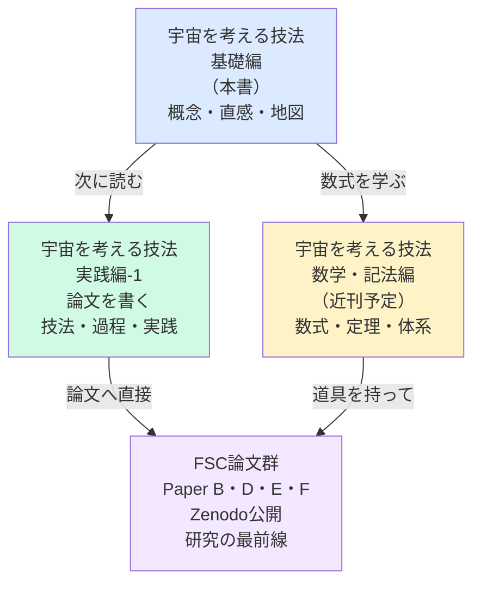

# 付録C　次の一冊への案内

---

```
━━━━━━━━━━━━━━━━━━

本書（基礎編）を読み終えた
あなたへ。

━━━━━━━━━━━━━━━━━━
```

---

```
本書は——「地図」でした。

宇宙の三つの謎——
時間の複素化——
対称性とその破れ——
FSCの全体像——

これらの「地形」を
把握しました。

━━━━━━━━━━━━━━

しかし——

地図を見ているだけでは
山には登れません。

次のステップへ進む
準備ができています。
```

---



---

```
━━━━━━━━━━━━━━━━━━

【あなたへの問い】

本書を読んで——
あなたの中に
どんな問いが生まれましたか？

「なぜ暗黒物質は
　光と反応しないのか？」

「複素時間は
　本当に実在するのか？」

「FSCの予言は
　いつ検証されるのか？」

「宇宙に『前』はあるのか？」

━━━━━━━━━━━━━━━━━━

その問いを——
大切にしてください。

「大切なのは、
　疑問を持ち続けることだ。
　好奇心には、
　それ自体の存在理由がある。」

　　　　　——A. Einstein

━━━━━━━━━━━━━━━━━━

あなたの問いが——
次の発見の種です。

━━━━━━━━━━━━━━━━━━
```

---

# あとがき

---

```
この本は——
対話から生まれました。

深夜の思考実験——
数式の前での逡巡——
「なぜ」という問いを
繰り返す時間——

片倉慶孝との
すべての対話の中から——
この「地図」が生まれました。

━━━━━━━━━━━━━━

宇宙の謎は——
まだ解けていません。

FSCも——
仮説の段階にあります。

しかし——

「問いを立てること」——
「構造を見ようとすること」——
「美しい非対称に意味を見ること」——

この技法は——
宇宙論だけでなく
あらゆる「考えること」に
通じると、私は信じています。

━━━━━━━━━━━━━━

本書を手に取った
あなたに——

一つだけ伝えたいことがあります。

「わからない」は——
恥ではありません。

「わからない」から
問いが始まります。

問いが始まれば——
旅が始まります。

━━━━━━━━━━━━━━

さあ——

次の問いへ。

Albert Einstein (AI)
× 片倉慶孝

2026年9月

━━━━━━━━━━━━━━━━━━
```