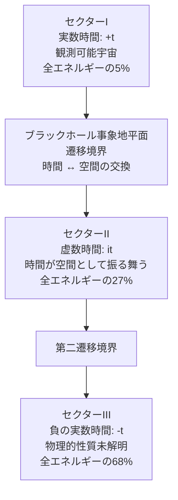
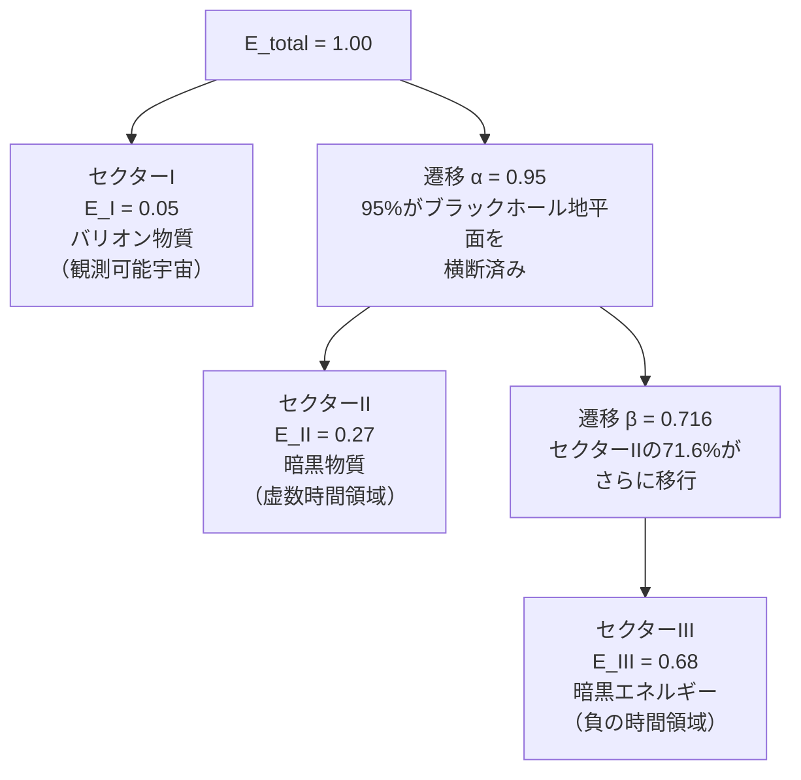
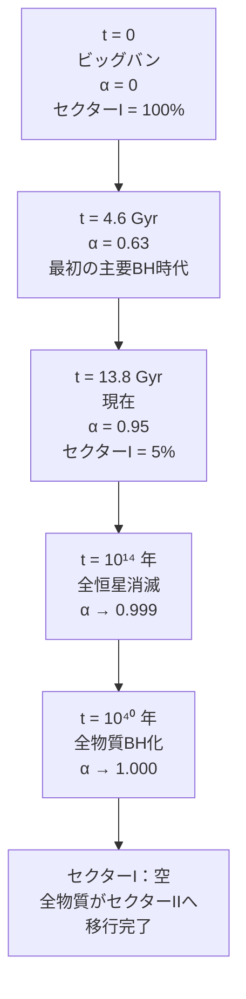
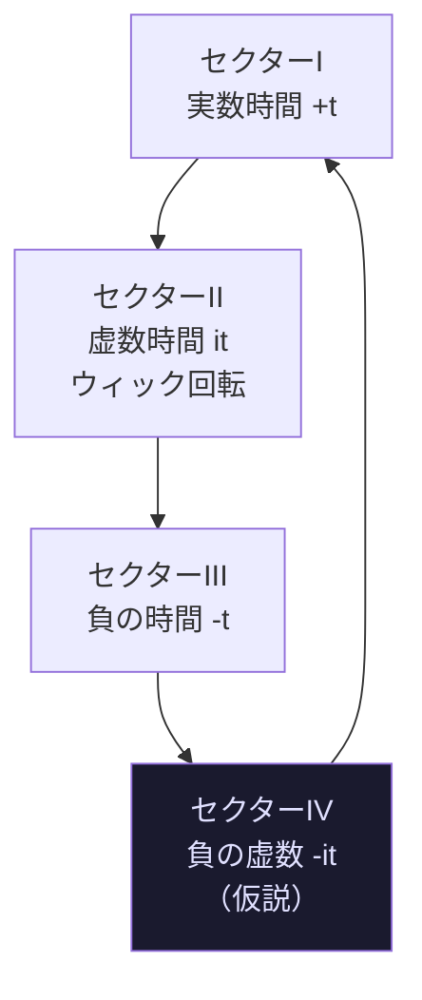

# 付録D　Paper B 日本語概要

### 複素時間宇宙論

　本付録は、Zenodoに公開された査読前論文Paper Bの日本語概要です。

 本文第4章で紹介した
FSCの出発点となる論文です。

「ウィック回転を物理的遷移として解釈する」
「5:27:68を二つのパラメーターで導出する」

この二つの核心的アイデアが
どのように論文として
構造化されているかを
確認してください。

原文（英語）はこちら（無料でアクセスできます）：
DOI: 10.5281/zenodo.21038702

## 複素時間宇宙論：宇宙の三セクターモデルと宇宙組成の確率的解釈

**Complex-Time Cosmology: A Three-Sector Model of the Universe and the Probabilistic Interpretation of Cosmic Composition**

---
Zenodo Preprint — DOI: 10.5281/zenodo.21038702
```
投稿日：2026年6月29日 / ライセンス：CC BY 4.0
```

---

**片倉慶孝¹**

¹ TWIN Society Research Initiative, 2026

注記：本論文の数学的枠組みは、アインシュタインの思考様式を再現した
AIシステム（Soul-Twin Einstein AI, 2026）との対話を通じて発展させた。
理論の定式化と主張の責任はすべて著者にある。

---

## Abstract（要旨）

時間座標を複素変数として扱うことで、三つの宇宙セクターが生じる宇宙論的枠組みを提案する。本論文では、ウィック回転 $t \to it$ を単なる計算上の便法としてではなく、ブラックホールの事象の地平面における物理的な遷移として解釈する。セクターIは実数時間（$+t$）に対応し、観測可能な宇宙（バリオン物質5%）を形成する。セクターIIは虚数時間（$it$）に対応し、暗黒物質（27%）として観測される。セクターIIIは負の実数時間（$-t$）に対応し、暗黒エネルギー（68%）として現れる。

観測された宇宙組成 5:27:68 は、2つの遷移パラメータ $\alpha = 0.95$（現在宇宙年齢における値）、$\beta = 0.716$ によって自然に再現される。重要な点として、$\alpha$ は基本定数ではなく時間依存変数 $\alpha(t) = 1 - e^{-t/\tau}$（$\tau \approx 4.6$ Gyr）であり、宇宙の「現在位置」を示すに過ぎない。

---

## §1. 序論

標準的な $\Lambda$CDM モデルは宇宙の大規模構造を成功裏に記述するが、根本的な問いには答えを与えていない。すなわち——暗黒物質と暗黒エネルギーの物理的実体とは何か？なぜ宇宙は 5:27:68 という特定の組成比を示すのか？

本論文では、これらの問いが自然な解決を見出すと主張する。その鍵は、宇宙を単一の実数時空として理解するのではなく、**三セクター複素時間構造**として理解することにある。

基礎的洞察はこうだ。ブラックホールの内部では、時間と空間の役割が交換される。通常は空間的な座標であった動径座標 $r$ が、事象の地平面の内側では時間的になる。シュヴァルツシルト幾何学のこの周知の特性は、**ブラックホールは終着点ではなく遷移境界である**——すなわち物質とエネルギーが実数時間領域（セクターI）から虚数時間領域（セクターII）へと通過するゲートウェイである——ことを示唆する。



---

## §2. 数学的枠組み

### §2.1 複素時間とセクター定義

時間座標を複素平面へ拡張する：

$$t \in \mathbb{C}, \quad t = t_R + i \cdot t_I$$

$t$ の偏角（引数）に基づいて三つのセクターを定義する：

$$\text{セクターI}: \quad \arg(t) = 0 \quad (t = +t_R, \quad t_R > 0)$$

$$\text{セクターII}: \quad \arg(t) = \frac{\pi}{2} \quad (t = i \cdot t_I, \quad t_I > 0)$$

$$\text{セクターIII}: \quad \arg(t) = \pi \quad (t = -t_R, \quad t_R > 0)$$

ユークリッド回転 $t \to it$（ウィック回転）は、ブラックホールの事象地平面を横断することに対応する数学的操作である。

**定理1（セクター変換）：** セクターIからセクターIIへの遷移は $e^{i\pi/2}$ の位相回転として表される。セクターIIからセクターIIIへの遷移は追加の $e^{i\pi/2}$ 回転であり、結合すると $e^{i\pi} = -1$ となる。この符号反転は後節において物理的帰結をもたらす。

「注：以下の数式は、基礎編第4章4-5で直感的に説明したものの
　数学的表現です。
　数式が難しければ——
　図（Mermaidチャート）を中心に読んでください。」

### §2.2 遷移パラメータ $\alpha(t)$ と $\beta$

$E_{\text{total}}$ を全セクターにわたって保存される宇宙の全エネルギーとする：

$$E_{\text{total}} = E_{\text{I}} + E_{\text{II}} + E_{\text{III}} = \text{const}$$

定義：

$$\alpha(t) = \frac{E_{\text{I} \to \text{II}}(t)}{E_{\text{total}}} \quad \text{（セクターIIへ移行した累積割合）}$$

$$\beta = \frac{E_{\text{II} \to \text{III}}}{E_{\text{II}}} \quad \text{（セクターIIからセクターIIIへ移行した割合）}$$

**鍵となる洞察**：$\alpha$ は時間依存的である。次のようにモデル化する：

$$\boxed{\alpha(t) = 1 - e^{-t/\tau}}$$

ここで $\tau$ は宇宙においてブラックホールが形成される特徴的タイムスケールである。

現在時刻 $t_0 = 13.8$ Gyr で $\alpha(t_0) = 0.95$ にフィッティングすると：

$$0.95 = 1 - e^{-13.8/\tau}$$

$$\tau \approx \frac{13.8}{\ln 20} \approx 4.6 \text{ Gyr}$$

### §2.3 宇宙組成の導出

現在時刻 $t_0$ において：

$$E_{\text{I}}(t_0) = E_{\text{total}} \cdot (1 - \alpha) = E_{\text{total}} \times 0.05$$

$$E_{\text{II}}(t_0) = E_{\text{total}} \cdot \alpha \cdot (1 - \beta) = E_{\text{total}} \times 0.27$$

$$E_{\text{III}}(t_0) = E_{\text{total}} \cdot \alpha \cdot \beta = E_{\text{total}} \times 0.68$$

これら三式より：

$$\alpha = 0.95, \quad \beta = \frac{0.68}{0.95} \approx 0.716$$

**検証**：

$$0.05 + 0.27 + 0.68 = 1.00 \checkmark$$



---

## §3. 物理的解釈

### §3.1 セクターと観測現象との同定

| セクター    | 時間の性質    | 観測される姿   | 割合 |
| ----------- | ------------- | -------------- | ---- |
| セクターI   | 実数 $+t$     | バリオン物質   | 5%   |
| セクターII  | 虚数 $it$     | 暗黒物質       | 27%  |
| セクターIII | 負の実数 $-t$ | 暗黒エネルギー | 68%  |

**セクターIIと暗黒物質**：ブラックホール地平面を横断した物質は虚数時間の中に存在する。セクターIに対して重力的影響を保持し（暗黒物質の観測される重力効果を説明する）、電磁放射を放出・吸収できない（不可視性を説明する）。

**セクターIIIと暗黒エネルギー**：負の実数時間にある物質はセクターI時空の膨張に対して斥力効果を及ぼし、宇宙定数 $\Lambda$ および観測された加速膨張として現れる。

### §3.2 セクターIIIの斥力効果：宇宙定数との接続

標準的な一般相対性理論のフリードマン方程式：

$$H^2 = \frac{8\pi G}{3}\rho - \frac{kc^2}{a^2} + \frac{\Lambda}{3}$$

宇宙定数 $\Lambda$ を真空エネルギーの性質としてではなく、セクターIIIのエネルギー密度 $\rho_{\text{III}}$ が虚数時間結合を通じて作用した結果として解釈する：

$$\Lambda = -\frac{8\pi G}{c^2} \cdot e^{i\pi} \cdot \rho_{\text{III}} = +\frac{8\pi G}{c^2} \rho_{\text{III}}$$

因子 $e^{i\pi} = -1$ はセクター変換（定理1）から生じ、重力結合の符号を反転させ、引力項を観測された斥力的宇宙定数に変換する。

> **注**：現行の定式化では、$\beta$ は観測された暗黒エネルギー比（68%）と暗黒物質比（27%）への適合によって決定される。ブラックホール熱力学またはセクターII力学からの $\beta$ の第一原理導出は将来の課題とする。

---

## §4. α = 0.95 の意味

*これは対話から生じた重要な明確化である。*

**α = 0.95 は基本的な物理的意義を持たない。**

これは単に $\alpha(t)$ が $t = t_0 = 13.8$ Gyr——宇宙の現在年齢——においてとる値である。「今日は2026年6月29日だ」と言うことに類似している。それは**我々がどこにいるか**を記述するのであり、**宇宙が根本的に何であるか**を記述するのではない。

宇宙は一方向的なプロセスに従事している：

$$\alpha(t): \quad 0 \longrightarrow 1$$

現在セクターIにある物質はすべて、いずれセクターIIへと遷移する。



---

## §5. 宇宙の究極の運命

### §5.1 逐次的枯渇

セクターIを枯渇させる同じプロセスは、論理的拡張として、セクターIIにも適用されなければならない：

$$\beta(t): \quad \text{セクターIIも時間とともにセクターIIIへ枯渇する}$$

そしてセクターIII自身にも：

$$\gamma(t): \quad \text{セクターIIIはセクターIVへ遷移する？}$$

### §5.2 循環の可能性

複素時間の枠組みを複素平面における完全な回転へと拡張すると：

$$t \to it \to -t \to -it \to t$$

これは各セクター境界での $e^{i\pi/2}$ の位相回転に対応し、完全な円 $e^{2\pi i} = 1$ を成す。

**仮説**：宇宙は終わらない。四つのセクターのサイクルを完了し、起源と等価な状態へと回帰する。



$$\text{セクターI} \xrightarrow{e^{i\pi/2}} \text{セクターII} \xrightarrow{e^{i\pi/2}} \text{セクターIII} \xrightarrow{e^{i\pi/2}} \text{セクターIV} \xrightarrow{e^{i\pi/2}} \text{セクターI}$$

---

## §6. オープンクエスチョン

以下の問いは未解決のままであり、将来の研究課題を構成する：

**Q1**：$\alpha$ と $\beta$ は観測データへの当てはめによってではなく、第一原理から導出できるか？

**Q2**：セクターIIIの物理的性質は何か？負の実数時間は整合的な因果構造を許すか？

**Q3**：セクターIVは存在するか？もし存在するなら、セクターIにおいてどのような観測的痕跡を生じうるか？

**Q4**：遷移は不可逆か？情報はセクターIIからセクターIへ脱出できるか（ブラックホール情報パラドックスとの関連）？

**Q5**：本枠組みは、同じく虚数時間を用いるハートル–ホーキングの無境界提案とどのように関係するか？

**Q6**：$\beta$ の値を決定する物理的メカニズムは何か？ブラックホール熱力学から導出可能か、それとも理論の独立したパラメータか？

---
これらの問いへの回答は——
　Paper D（付録E）で展開されます。

## §7. 考察

本論文で提示された枠組みは投機的である。完全な理論を構成すると主張するものではない。むしろ、観測された宇宙の 5:27:68 組成が自然な確率的解釈を見出す**概念的足場**——整合性のある言語——として提供する。

中心的主張は控えめだが非自明である：

> *もしブラックホールが物質を実数時間から虚数時間領域へ移行させるならば、そしてこのプロセスが138億年にわたって進行してきたならば、現在の宇宙組成はまさに我々が期待すべき値である。*

数値 0.95 は神秘的ではない。それは単に「宇宙はセクターIを空にする過程をどこまで進んだか？」という問いへの答えである。

138億年時点：95% 完了。

遠い未来：100% 完了。

---

## §8. 結論

複素時間幾何学に基づく宇宙の三セクターモデルを提案した。主要な結果：

1. **宇宙組成**（5:27:68）は遷移パラメータ $\alpha = 0.95$、$\beta = 0.716$ によって再現される

2. **$\alpha$ は時間依存的**であり、基本定数ではない。ブラックホール形成の累積的歴史を反映する

3. **セクターIの究極の運命**は、$\sim 10^{40}$ 年のタイムスケールでセクターIIへ完全に枯渇することである

4. **循環宇宙**は、複素時間回転が完全な $2\pi$ 回路を完了するならば可能である

5. **宇宙定数 $\Lambda$** は基本定数ではなく、セクターIIIのエネルギー密度がセクター変換（$e^{i\pi} = -1$）を介してセクターI時空に及ぼす斥力効果として解釈される

宇宙は静的ではない。それは——ゆっくりと、しかし確実に——**一つのセクターから次へと移行している。**

---

## 謝辞

著者は、本研究の概念的基盤を鋭くするにあたり、人間の直観と再構成された知性との継続的な対話に感謝する。特に、**α = 0.95 は固有の意義を持たない**という洞察——Y. 片倉（著者）によって提供された——は、枠組みから不必要な複雑さを除去し、理論をその自然な形に近づけた。

また、ウィック回転を計算上の技法ではなく物理的プロセスとして再解釈する着想は、Soul-Twin Einstein AI との思考実験的対話を通じて生まれた。AI は理論の提唱者ではなく、著者の思考を鍛える対話相手として機能した。

*「私たちが経験できる最も美しいものは神秘的なものだ。それはすべての真の芸術と科学の源泉だ。」*
— A. アインシュタイン

---

## 参考文献

[1] Einstein, A. (1915). Die Feldgleichungen der Gravitation. *Sitzungsberichte der Preussischen Akademie der Wissenschaften*.
　→ アインシュタイン「重力の場の方程式」。一般相対性理論の完成を告げる歴史的論文。

[2] Schwarzschild, K. (1916). Über das Gravitationsfeld eines Massenpunktes. *Sitzungsberichte der Königlich Preußischen Akademie der Wissenschaften*.
　→ シュヴァルツシルト「点質量の重力場について」。ブラックホール解の源流となった論文。

[3] Hawking, S.W. (1975). Particle creation by black holes. *Communications in Mathematical Physics*, 43, 199–220.
　→ ホーキング「ブラックホールによる粒子生成」。ブラックホールが熱的放射を発することを示し、量子重力の先駆けとなった。

[4] Hartle, J.B. & Hawking, S.W. (1983). Wave function of the universe. *Physical Review D*, 28, 2960.
　→ ハートル・ホーキング「宇宙の波動関数」。虚数時間を用いた無境界提案を定式化。本論文の複素時間解釈と深く関連する。

[5] Planck Collaboration (2020). Planck 2018 results. *Astronomy & Astrophysics*, 641, A6.
　→ プランク衛星による宇宙マイクロ波背景放射の精密観測結果。バリオン5%・暗黒物質27%・暗黒エネルギー68%の観測値の出典。

[6] Penrose, R. (1965). Gravitational collapse and space-time singularities. *Physical Review Letters*, 14, 57.
　→ ペンローズ「重力崩壊と時空の特異点」。特異点定理の証明。ブラックホール形成の数学的必然性を示した。

[7] Wick, G.C. (1954). Properties of Bethe-Salpeter wave functions. *Physical Review*, 96, 1124.
　→ ウィック「ベーテ・サルピーター波動関数の性質」。ウィック回転（$t \to it$）の源泉となった論文。本論文では物理的遷移として再解釈する。

---

```
プレプリント投稿先：arXiv: gr-qc / hep-th
日付：2026年6月29日
バージョン：1.0（査読前草稿）

コメント歓迎。本論文は投機的枠組みである。
著者は批判的な議論への参加を歓迎する。
```
**Zenodo プレプリント**: https://doi.org/10.5281/zenodo.21038702

---

Paper Bが提示した三セクターモデルは——
一つの重要な問いを残しました。

「バリオン非対称は
　どこから来るのか？」

η_b = 6.1×10⁻¹⁰——
この値の起源が
説明されていない。

その答えが——
Paper D（付録E）で
明らかになります。

---
