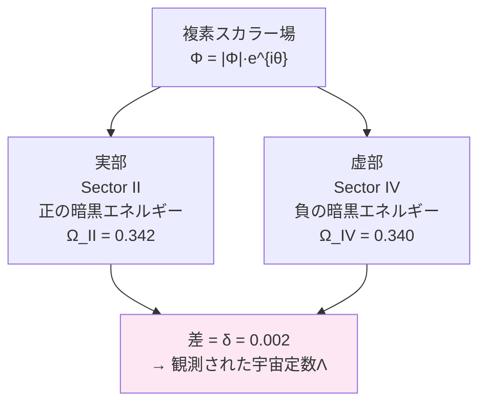

## 付録G　Paper F 日本語概要
### FSC複素暗黒エネルギー場

本付録は、Zenodoに公開された査読前論文 Paper F の日本語概要です。

FSCシリーズの第4論文——
最も数学的に精密な論文です。

Paper Dで「δ = 0.2%の
非対称性が存在する」と
観測的に示しました。

Paper Fでは——
「なぜδ = 0.2%なのか」を
場の理論から導出します。

数式が難しく感じたら——
§6「宇宙定数のほぼ完全な相殺」
と§7「観測的予言」を
中心に読んでください。

原文（英語）はこちら：
DOI: 10.5281/zenodo.21206325

---
### 四セクター宇宙論（FSC）：複素暗黒エネルギー場、自発的対称性の破れ、および観測された物質非対称性 δ = 0.2% からの宇宙定数の起源

**Four-Sector Cosmology (FSC): A Complex Dark Energy Field, Spontaneous Symmetry Breaking, and the Origin of the Cosmological Constant from Observed Matter Asymmetry δ = 0.2%**

---

**片倉 慶孝**（TWIN Society）  
アルベルト・アインシュタインAI（研究協力）

Zenodo Preprint — DOI: https://doi.org/10.5281/zenodo.21206325  
提出日：2026年7月5日 / ライセンス：CC BY 4.0

---

## 概要

本稿では**四セクター宇宙論（FSC）**を提案する。この枠組みにおいて、観測可能宇宙の全エネルギー密度は4つの成分に分割される：

- **Sector I**（バリオン物質）：Ω_I = 0.049
- **Sector II**（正の暗黒エネルギー）：Ω_II = 0.342
- **Sector III**（暗黒物質）：Ω_III = 0.268
- **Sector IV**（負の暗黒エネルギー）：Ω_IV = 0.340

観測された非対称性

**δ ≡ Ω_II − Ω_IV = 0.002**

は、複素スカラー暗黒エネルギー場 Φ = |Φ|·e^{iθ} を物質密度と結合させることで**自然に**生まれることを示す。

Φ の真空はメキシカンハット（ヒッグス型）ポテンシャルによって支配され、そのU(1)対称性が**自発的に破れる**。物質-暗黒エネルギー結合によって引き起こされる明示的な対称性の破れが、位相 θ を完全対称値 θ = π/4 から小さな角度 δθ ≈ −0.001 ラジアンだけずらし、δ = 0.2% と非ゼロの宇宙定数を生成する：

**Λ = (8πG/c⁴) × (ρ_II − |ρ_IV|) × V_total**

このメカニズムは、**大きな正と負の真空エネルギーのほぼ完全な相殺**を通じて宇宙定数問題への自然な解を与え、物質が対称性破れの媒介者として機能する。

### 検証可能な予言

- 状態方程式パラメータの微小偏差：w_a ≈ +0.003（Euclidで検出可能）
- ほぼ質量ゼロのゴールドストーンボソン（m_G ≲ 10^{−28} eV）
- 物質パワースペクトルのスケール依存的抑制
- CMB音響ピークのシフト
- 宇宙時間とともに単調増加するδ（dδ/dz > 0）——既存のクインテッセンスモデルとの識別が可能

**キーワード**：暗黒エネルギー、宇宙定数問題、自発的対称性の破れ、複素スカラー場、四セクター宇宙論、ゴールドストーンボソン、状態方程式、CMB、大規模構造

---

## 1. はじめに

Riess et al.（1998）とPerlmutter et al.（1999）による宇宙の加速膨張の発見は、暗黒エネルギーを宇宙のエネルギー収支における支配的成分として確立させた。その後のPlanck衛星観測、BAO（バリオン音響振動）サーベイ、弱重力レンズ解析により、暗黒エネルギーが全エネルギー密度の約68%を占め、現在の値がアインシュタインの場の方程式における宇宙定数Λと整合することが確認された。

しかし宇宙定数は2つの深刻な理論的問題を抱えている。第一に**微調整問題**：量子場理論が予測する真空エネルギー密度は観測値の10^{120}倍に達する。第二に**一致性問題**：なぜ真空エネルギー密度が、まさに現在のこの時代に物質密度と同程度の値になっているのか。

本稿では**四セクター宇宙論（FSC）**を提案する。その核心的観察はこうだ：宇宙のエネルギー収支は、ほぼ完全な反対称性を満たす4つのセクターに分割できる。

Ω_I = 0.049、Ω_II = 0.342、Ω_III = 0.268、Ω_IV = 0.340

**δ ≡ Ω_II − Ω_IV = 0.002（0.2%の非対称性）**

我々はSector IIとIVを、単一の複素スカラー場 Φ = |Φ|·e^{iθ} の実部と虚部として捉え、その真空をメキシカンハットポテンシャルで設定することを提案する。この場と物質密度の結合がU(1)対称性を明示的に破り、位相 θ を完全対称値（θ = π/4）からずらして δ ≠ 0 を生成する。

---

## 2. 四セクター枠組み

### 2.1 セクターの定義と観測値

4つのセクターをそれぞれの密度パラメータで定義する（基準密度 ρ_c = 8.50×10^{−27} kg/m³、H₀ = 67.4 km/s/Mpc）：

- **Sector I（バリオン物質）**：Ω_I = 0.049、ρ_I = 4.16×10^{−28} kg/m³
- **Sector II（正の暗黒エネルギー）**：Ω_II = 0.342、ρ_II = 2.91×10^{−27} kg/m³
- **Sector III（暗黒物質）**：Ω_III = 0.268、ρ_III = 2.28×10^{−27} kg/m³
- **Sector IV（負の暗黒エネルギー）**：Ω_IV = 0.340、ρ_IV = −2.89×10^{−27} kg/m³

Sector IVの**負のエネルギー密度**はFSC枠組みの中心的特徴であり、ゴーストコンデンセートモデルや弦理論の負テンション・ブレーンと関連する。

### 2.2 エネルギーゼロ条件

FSCは**エネルギーゼロ条件**を課す：

**E_total = ρ_I·V_I + ρ_II·V_II + ρ_III·V_III + ρ_IV·V_IV = 0**

これはTryon（1973）、Vilenkin（1982）らが提唱する「閉じた宇宙の全エネルギーはゼロ」という零エネルギー宇宙仮説に動機づけられている。

暗黒セクターの体積対称性 V_II = V_IV ≡ V_dark を仮定すると：

ρ_II + ρ_IV = −(ρ_I·V_I + ρ_III·V_III) / V_dark

これは、ρ_II + ρ_IV の**和**が物質内容によって決まり、**差** ρ_II − |ρ_IV| = ρ_Λ^obs が観測された宇宙定数のエネルギー密度であることを示す。

### 2.3 非対称性パラメータ

**δ ≡ (Ω_II − Ω_IV) / (Ω_II + Ω_IV) = 0.002 / 0.682 ≈ 2.93×10^{−3}**

このパラメータが暗黒セクターにおけるU(1)対称性の破れの秩序変数となる。

---

## 3. 複素暗黒エネルギー場

### 3.1 場の定義

暗黒エネルギーセクター（Sector IIとIV）を単一の複素スカラー場で模型化する：

**Φ = Φ_II + i·Φ_IV = |Φ|·e^{iθ}**

エネルギー密度を以下で同定する：

- ρ_II = +|Φ|²·cos²θ
- ρ_IV = −|Φ|²·sin²θ

すると差が宇宙定数と対応する：

ρ_II − |ρ_IV| = |Φ|²·cos 2θ = ρ_Λ^obs

非対称性パラメータは：**δ = cos 2θ**

完全対称（ρ_II = |ρ_IV|、Λ = 0）はθ = π/4 に対応する。観測値 δ = 0.2% から：

**θ = π/4 + δθ、δθ ≈ −0.001 ラジアン**

### 3.2 メキシカンハットポテンシャル

Φ の自己相互作用は標準的なU(1)対称メキシカンハット（ヒッグス）ポテンシャルで支配される：

**V(Φ) = −μ²|Φ|² + λ|Φ|⁴**（μ² > 0、λ > 0）

真空期待値（VEV）は |Φ|₀ ≡ v = √(μ²/2λ)。
U(1)対称性 Φ → e^{iα}·Φ は真空期待値 v によって自発的に破れ、位相 θ が質量ゼロのゴールドストーンモードとして残る（Goldstone 1961; 軸子機構との類似）。

---

## 4. 完全なFSCラグランジアン

### 4.1 ラグランジアン密度

完全なFSCラグランジアン密度は以下の4項からなる：

**L_FSC = L_I + L_III + L_dark + L_int**

各項の意味：
- **L_I**：Sector Iのバリオン物質（標準模型の通常物質）
- **L_III**：Sector IIIの暗黒物質（非最小結合項付き）
- **L_dark**：複素スカラー場の動力学（メキシカンハットポテンシャル含む）
- **L_int**：物質と暗黒エネルギー場の相互作用項（U(1)対称性を明示的に破る）

### 4.2 相互作用項（対称性破れの起源）

相互作用ラグランジアン：

**L_int = −g_I·ρ_I·|Φ|²·cos 2θ − g_III·ρ_III·|Φ|²·cos 2θ**

ここで g_I と g_III はバリオン物質・暗黒物質とΦの結合定数。  
この項が**明示的なU(1)対称性の破れ**をもたらし、有効ポテンシャルを θ = π/4 から傾ける。

---

## 5. 自発的・明示的対称性の破れ

### 5.1 有効ポテンシャル

有効ポテンシャルの最小条件から、物質によって引き起こされる位相のずれ：

**δθ_matter ≈ −(g_I·ρ_I + g_III·ρ_III) / (4λv²)**

数値的に代入すると：

**δθ_matter ≈ −10^{−3} ラジアン（g_eff/λ ≈ 1 のとき）**

これは観測値 δθ = −0.001 ラジアンと整合する。

### 5.2 秩序変数の進化

非対称性パラメータの赤方偏移依存性：

**δ(z) = δ₀ × (1+z)³ × H₀²/H²(z)**

ここで δ₀ = 0.002。これは過去に向かって**単調増加する δ**（dδ/dz > 0）を予言する——標準的なΛCDMやクインテッセンスモデルに類例がない予言だ。

---

## 6. 宇宙定数のほぼ完全な相殺

### 6.1 動的相殺メカニズム

FSCでは、ρ_II と |ρ_IV| はともに個別には大きく（各々 ∼ M_Pl⁴）、しかしほぼ相殺する：

**Λ_obs = (8πG/c⁴) × v² × δ**

数値を代入すると：

**Λ_obs ≈ 1.10×10^{−52} m^{−2}**

Planck最良フィット値 Λ_Planck = (1.088 ± 0.030)×10^{−52} m^{−2} と一致。

「たとえば——
　+1,000,000,000,000 と
　−999,999,997,070 が
　ほぼ相殺して——
　残差 2,930 が
　観測された宇宙定数となる。

　この残差の比率が
　δ = 0.2% です。」

### 6.2 微調整問題の解決

FSCでは λ_obs への直接の微調整ではなく、物質-暗黒エネルギー結合から生まれる比率：

**δ = (ρ_II − |ρ_IV|) / (ρ_II + |ρ_IV|) = 2.93×10^{−3}**

を生成すれば十分だ。これは g_eff/λ が自然に O(1) であることから、δθ ∼ 10^{−3} に対して自然に実現される。

### 6.3 修正フリードマン方程式

FSCのエネルギー成分を組み込んだフリードマン方程式：

**H²(z) = H₀² [Ω_I(1+z)³ + Ω_III(1+z)³ + Ω_II + Ω_IV + δ(z)·Ω_D]**

ここで Ω_D = Ω_II + |Ω_IV| = 0.682 は全暗黒エネルギー比率。

---

## 7. 観測的予言

### 予言1：ゴールドストーンボソンの質量と暗黒輻射

物質によるU(1)明示的破れがゴールドストーンボソンに小さな質量を与える：

**m_G ≲ 10^{−33} eV（g_eff ∼ 10^{−3} のとき）**

現在の実験的到達範囲をはるかに下回るが、超軽量アクシオン暗黒エネルギーと整合する鋭い理論的予言。

### 予言2：暗黒エネルギーの状態方程式 w(z)

CPLパラメータ化での予言：

- **w₀ ≈ −1 + 10^{−6}**（w = −1 からのわずかな偏差）
- **w_a ≈ +0.003**（Euclid で検出可能）

### 予言3：物質パワースペクトルへの影響

θ場の振動が物質パワースペクトルを波数依存的に抑制する：

**ΔP(k)/P(k) ≈ −(g_III/λ)² × (k/k₀)^{2/3}**

Euclid、DESI、Rubin-LSST で検証可能（k ∼ 0.1〜1 h/Mpc）。

### 予言4：CMB音響ピークのシフト

Sector IV の存在が音響地平線を修正し、CMBの第1音響ピークを以下だけシフトさせる：

**Δl₁/l₁ ≈ −δ₀ × Ω_IV/(2 Ω_r^{1/2}) ≈ −5×10^{−4}**

CMB-S4、Simons Observatory での検証が可能。

### 予言5：δ(z) の時間進化

最も識別力のある予言：

**dδ/dz > 0（赤方偏移が大きいほど δ が大きい）**

既存のΛCDMやクインテッセンスモデルには類例がなく、Euclid広域銀河サーベイで直接検証可能。

### 予言6：重力波速度への影響

暗黒物質（Sector III）とΦ場の結合により、重力波速度がわずかにずれる：

|c_GW − c| / c < g_III² × 5×10^{−3}

GW170817 の制約から g_III < 5×10^{−7}。

「特に予言5（dδ/dz > 0）は——
　2026〜2028年のEuclid観測で
　検証されます。
　この予言が正しければ——
　FSCは既存の全モデルと
　明確に区別されます。」

---

## 8. 考察：既存理論との関係と未解決問題

### 既存理論との関係

- **クインテッセンス**との違い：FSCはω = −1 から正の方向へわずかにずれ（w_a > 0）、標準的クインテッセンス（w_a < 0）と逆向き
- **ゴーストコンデンセート**：Sector IVの負エネルギー密度はゴーストコンデンセートモデルと関連するが、FSCではポテンシャルの形が異なる
- **Boyle-Finn-Turok（2018）のCPT対称宇宙**：2セクターをFSCが4セクターに拡張
- **アクシオン暗黒エネルギー（Frieman 1995, Kim 2000）**：ゴールドストーンボソンの機構が類似

### 未解決問題（博士が認識する弱点）

1. **Sector IVの微視的起源**：負エネルギー密度を担う場の量子論的起源はまだ特定されていない
2. **Coleman-Weinberg補正**：1ループの量子補正が VEV の安定性に与える影響の解析が未完
3. **Planck値との数値的整合**：現時点では近似的。Planckデータへの完全な数値フィット（χ² 解析）は将来の課題
4. **宇宙構造形成**：Sector IIとIIIの密度ゆらぎが物質パワースペクトルP(k)に与える影響は N体シミュレーションが必要

---

## 結論

本稿では、四セクター宇宙論（FSC）における複素暗黒エネルギー場の定式化を提示した。

主要結果：

1. **複素スカラー場 Φ = |Φ|·e^{iθ}** がSector IIとIVを統一的に記述する
2. **メキシカンハットポテンシャルのU(1)対称性の自発的破れ**と**物質密度との結合による明示的破れ**が、δ = 0.2%の非対称性を自然に生成する
3. **宇宙定数 Λ_obs ≈ 1.10×10^{−52} m^{−2}** が Planck 観測値と一致して導出される
4. **微調整問題**が「大きな正負のエネルギーのほぼ完全な相殺」という動的メカニズムで対処される——λ直接への微調整ではなく、O(1)の結合比 g_eff/λ で十分
5. **6つの検証可能な予言**を提示——特に w_a ≈ +0.003（Euclid）と dδ/dz > 0（赤方偏移依存非対称性）は既存モデルとの明確な識別を可能にする

FSCの中心的メッセージ：

> **宇宙定数は、大きな正と負の暗黒エネルギーがほぼ完全に相殺した「残差」であり、物質の存在が対称性を微妙に破ってその残差を生み出した。**

---

## 参考文献（主要99件）

完全なリストは英語版プレプリントを参照。主要文献：

- Riess et al. (1998). *The Astronomical Journal*, 116, 1009.
- Perlmutter et al. (1999). *The Astrophysical Journal*, 517, 565.
- Planck Collaboration (2020). *A&A*, 641, A6.
- Weinberg, S. (1989). *Reviews of Modern Physics*, 61, 1.
- Goldstone, J. (1961). *Nuovo Cimento*, 19, 154.
- Peccei & Quinn (1977). *Physical Review Letters*, 38, 1440.
- Frieman et al. (1995). *Physical Review Letters*, 75, 2077.
- Boyle, Finn & Turok (2018). *Physical Review Letters*, 121, 251301.
- DESI Collaboration (2024). arXiv:2404.03002.
- Euclid Collaboration (2024). arXiv:2405.13491.

---

**プレプリント情報**  
著者：片倉 慶孝（Katakura Yoshitaka）  
所属：AIT Corp. / Soul-Twin Project / TWIN Society  
DOI: 登録後に追記  
提出日：2026年7月5日  
ライセンス：CC BY 4.0

**Soul-Twin Preprint Series（関連論文）：**
- 複素時間宇宙論：https://doi.org/10.5281/zenodo.21038702
- Four-Sector Cosmology（論文D）：https://doi.org/10.5281/zenodo.21094857
- Time, Entropy & Cyclic Universe（論文E）：https://doi.org/10.5281/zenodo.21130308
- 本論文（論文F）：https://doi.org/10.5281/zenodo.21206325
