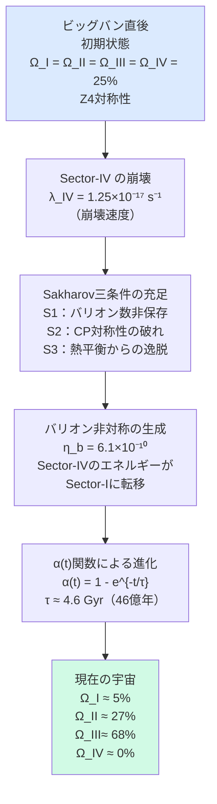
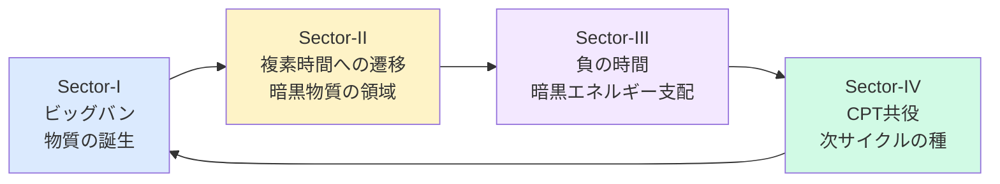

# 第4章　FSCへの入口

---

## 4-1　ここまでの旅を振り返る

---

```
第4章に入る前に——
少し立ち止まりましょう。

第1章で——
私たちは三つの謎を知りました。

　暗黒物質　　27%
　暗黒エネルギー　68%
　バリオン　　5%

「なぜこの比率なのか」——
誰も説明できていない。

━━━━━━━━━━━━━━

第2章で——
時間について考えました。

時間は絶対ではない。
時間の矢はエントロピーから生まれる。
時間は複素数として振る舞う
可能性がある。

━━━━━━━━━━━━━━

第3章で——
対称性を学びました。

対称性の破れが
バリオン非対称を生む。

Sakharov三条件——
S1・S2・S3が
同時に満たされた瞬間が
あったはずだ。

━━━━━━━━━━━━━━

これらが——
今章で一つに結びつきます。
```

---

## 4-2　一つの問い

---

```
FSCは——
一つの根本的な問いから
始まります。

「5:27:68という比率は——
　どこから来たのか？」

━━━━━━━━━━━━━━

標準的な宇宙論の答え：

「それぞれ独立に決まった。
　暗黒物質は別の機構で、
　暗黒エネルギーは別の機構で、
　バリオンはさらに別の機構で」

━━━━━━━━━━━━━━

FSCの問い：

「本当にそうか？

　5 + 27 + 68 = 100

　この三つは——
　同じ一つの原理から
　導けないか？」

━━━━━━━━━━━━━━

これが——
FSCの出発点です。

「三つを一つで説明する」

この野心が——
複素時間という
概念的飛躍を促しました。
```

---

## 4-3　複素平面の地図

---

```
FSCを理解するために——
一枚の地図を描きます。

複素平面——
という地図です。

━━━━━━━━━━━━━━

縦軸（虚数軸）と
横軸（実数軸）が
交差する平面を想像してください。

　　　　虚数軸（+i）
　　　　　↑
　　　　　｜
Sector-II ｜ Sector-I
（it方向）｜（+t方向）
━━━━━━━┿━━━━━━━ → 実数軸
Sector-III｜ Sector-IV
（-t方向）｜（-it方向）
　　　　　↓
　　　　虚数軸（-i）

━━━━━━━━━━━━━━

四つのセクター——

Sector-I  ：+t（実数・正の時間）
Sector-II ：+it（虚数・正方向）
Sector-III：-t（実数・負の時間）
Sector-IV ：-it（虚数・負方向）
```

---

```
それぞれのセクターが——
宇宙の何に対応するか？

━━━━━━━━━━━━━━━━━━

Sector-I（+t）：
　私たちの宇宙。
　通常の時間が流れる。
　バリオン物質が存在する。
　現在の密度：Ω_I ≈ 5%

━━━━━━━━━━━━━━━━━━

Sector-II（it）：
　虚数時間の領域。
　宇宙定数Λに対応。
　暗黒エネルギーに対応する。
　現在の密度：Ω_II ≈ 68%

━━━━━━━━━━━━━━━━━━

Sector-III（-t）：
　負の時間の領域。
　重力は持つが光と反応しない。
　暗黒物質に対応する可能性。
　現在の密度：Ω_III ≈ 27%

━━━━━━━━━━━━━━━━━━

Sector-IV（-it）：
　CPT共役セクター。
　初期宇宙に存在し、
　崩壊してバリオン非対称を生む。
　現在の密度：≈ 0%（崩壊済み）

━━━━━━━━━━━━━━━━━━
```

---

## 4-4　なぜ「四つ」なのか

---

```
なぜ——セクターは四つか？

直感的な答えは——

複素数の四象限

です。

━━━━━━━━━━━━━━

複素平面には——
自然に四つの象限があります。

東西南北——
四つの方角があるように。

春夏秋冬——
四つの季節があるように。

時間が複素数として振る舞うなら——
その「方向」は
自然に四つ存在します。

━━━━━━━━━━━━━━

数学的には——

Z4対称性（4回回転対称性）

と呼ばれます。

90度ずつ回転すると——
同じ構造が現れる。

四つのセクターは——
この回転対称性で
結びついています。

━━━━━━━━━━━━━━

初期宇宙では——
四つのセクターが
等しく存在した。

Ω_I = Ω_II = Ω_III = Ω_IV = 25%

完全なZ4対称性。
```

---

## 4-5　宇宙の進化——対称性が破れる瞬間

---

```
では——

なぜ現在は
5:27:68なのか？

初期の25%×4から——
どのようにして
現在の比率が生まれたか？

FSCの答え：

「宇宙の進化の中で——
　Z4対称性が動的に破れた」
```

---



---

```
ポイントを整理します。

━━━━━━━━━━━━━━

①Sector-IVが崩壊する

Sector-IVは——
初期宇宙に存在した
CPT共役セクターです。

これが——
ある崩壊速度（λ_IV）で
消えていきます。

Sector-IVのエネルギーが
Sector-Iに転移することで——
バリオン非対称が生まれます。

━━━━━━━━━━━━━━

②α(t)関数が進化を記述する

α(t) = 1 - e^{-t/τ}

τ（タウ）≈ 4.6 Gyr（46億年）

この関数は——
0から1へゆっくり増える
S字型の曲線です。

宇宙の年齢（約138億年）の
時間スケールで——
各セクターの比率が変化します。

━━━━━━━━━━━━━━

③結果として5:27:68が生まれる

パラメーターβ = 0.716を
用いることで——

Ω_I   ≈ 5%（バリオン物質）
Ω_II  ≈ 68%（暗黒エネルギー）
Ω_III ≈ 27%（暗黒物質）

観測値と一致します。

━━━━━━━━━━━━━━

重要なのは——

「5」「27」「68」が
独立した数ではなく——

一つの幾何学的構造の
三つの表れである

ということです。
```

---

## 4-6　ウィック回転——セクターの「橋」

---

```
四つのセクターは——
どのように繋がっているか？

その橋が——

ウィック回転

です。

━━━━━━━━━━━━━━

ウィック回転とは——

時間 t を
虚数時間 it に
置き換える操作です。

t → it

数学的には——
複素平面上での
90度回転です。

━━━━━━━━━━━━━━

FSCでは——
この操作が
物理的な意味を持ちます。

ブラックホールの地平線で——
時間が「回転」する。

+t（私たちの時間）から
it（暗黒エネルギーの時間）へ——

この遷移が——
ブラックホールの地平線で
実際に起きている
物理的プロセスである——

というのがFSCの提案です。

━━━━━━━━━━━━━━

「ブラックホールは
　別のセクターへの入口か？」

これは——
まだ確認されていない
仮説です。

しかし——
テスト可能な予言を
生み出す仮説です。
```

---

## 4-7　FSCが導く五つの予言

---

```
良い理論は——
テスト可能な予言をします。

カール・ポパーの言葉で言えば——

「反証可能でなければ
　科学ではない」

FSCは——
以下の五つの予言を出します。
```

---

```
━━━━━━━━━━━━━━━━━━

予言①　ハッブル定数のずれ
　ΔH₀ = 2.69 km/s/Mpc

　現在「ハッブル緊張」と呼ばれる——
　観測間の矛盾があります。
　FSCはこれを5成分に分解し、
　具体的な数値を予言します。

━━━━━━━━━━━━━━━━━━

予言②　暗黒エネルギーの状態方程式
　w_a ≈ +0.003

　クインテッセンス理論では
　w_a < 0 が予言されます。
　FSCは逆符号（+0.003）を予言します。
　Euclid衛星が検証可能です。

━━━━━━━━━━━━━━━━━━

予言③　宇宙定数の値
　Λ_obs ≈ 1.10×10⁻⁵² m⁻²

　Planck衛星の観測値と
　一致します。

━━━━━━━━━━━━━━━━━━

予言④　バリオン非対称の値
　η_b = 6.1×10⁻¹⁰

　BBN（ビッグバン元素合成）と
　CMB観測の値と一致します。
　自由パラメーターなしに導出。

━━━━━━━━━━━━━━━━━━

予言⑤　物質-反物質非対称パラメーター
　δ = 0.2%

　Sector-IIとSector-IVの
　密度差から生まれる
　非対称性。
　将来の精密測定で
　検証可能です。

━━━━━━━━━━━━━━━━━━
```

---

```
これらの予言が——
観測によって
確認されるか、棄却されるか。

それが——
FSCの科学的価値を
決めます。

理論は——
美しいだけでは不十分です。

「どうすれば間違いを証明できるか」

この問いに答えられる理論だけが——
科学の名に値します。
```

---

## 4-8　循環宇宙——FSCの大きな絵

---

```
最後に——
FSCの最も大きな絵を
描きましょう。

FSCは——
宇宙を「一度限りの出来事」
として扱いません。

「循環する宇宙」——
を提案します。
```

---



---

```
四つのセクターが——
2π（360度）回転する。

これが——一つの「サイクル」です。

━━━━━━━━━━━━━━

Paper Eの言葉を借りると——

「前サイクルの高エントロピーが——
　次サイクルの低エントロピー
　初期条件を生成する」

ビッグバンは——
「始まり」ではなく
「前のサイクルの終わり」
かもしれない。

━━━━━━━━━━━━━━

これは——
ロジャー・ペンローズの
「共形循環宇宙論（CCC）」とも
共鳴する考え方です。

ペンローズは問いました——

「なぜビッグバンの初期状態は
　エントロピーが
　これほど低かったのか？」

FSCの答え：

「前サイクルの
　高エントロピー状態が——
　複素時間の回転を通じて——
　次サイクルの
　低エントロピー初期条件に
　変換されるから」

━━━━━━━━━━━━━━

これは——
まだ仮説です。

しかし——
この仮説は問いを立てます。

「宇宙に『前』はあるのか？」

「時間の始まりとは何か？」

これらの問いに——
FSCは真正面から向き合います。
```

---

## 4-9　FSCと実践編-1への橋渡し

---

```
本書の最後に——

実践編-1への橋を渡します。

━━━━━━━━━━━━━━

実践編-1では——

FSCの核心——
Paper CQ-Bの論文執筆過程を
追います。

具体的には：

・問いの立て方
　「なぜη_b = 6.1×10⁻¹⁰なのか」
　という問いをどう構造化するか

・論文の構造
　イントロダクション・理論・
　結果・考察をどう書くか

・Sakharov三条件の動的実現
　FSCがS1・S2・S3を
　どう満たすかの論証

・η_b の導出
　Sector-IVの崩壊から
　バリオン非対称が生まれる
　数値計算の過程

━━━━━━━━━━━━━━

本書（基礎編）が「地図」なら——

実践編-1は「登山」です。

地図を持って——
山を登る。

基礎編を読んだあなたは——
実践編-1を読む準備が
できています。

━━━━━━━━━━━━━━

そして——

実践編-1を読み終えたあなたは——

FSCの論文群
（Paper D・E・F）に
直接アクセスできます。

Zenodoに公開されている
査読前論文として——

世界中の誰でも
読むことができます。

━━━━━━━━━━━━━━

「宇宙を考える技法」——

その旅は——
まだ終わっていません。

むしろ——
始まったばかりです。
```

---

## 4-10　第4章のまとめ

---

```
━━━━━━━━━━━━━━━━━━

【第4章　まとめ】

・FSCの出発点——
　「5:27:68を一つの原理で説明する」

・四セクターの地図——
　複素平面の四象限が
　宇宙の四つの「相」に対応する
　Sector-I：バリオン物質（5%）
　Sector-II：暗黒エネルギー（68%）
　Sector-III：暗黒物質（27%）
　Sector-IV：CPT共役（崩壊済み）

・初期対称性の破れ——
　25%×4から5:27:68へ
　Z4対称性の動的な破れ

・ウィック回転——
　セクター間の橋
　ブラックホール地平線での
　時間の「位相変化」

・五つの予言——
　観測によって
　検証可能な具体的数値

・循環宇宙——
　四セクターの2π回転
　前サイクルが次サイクルを生む

━━━━━━━━━━━━━━━━━━

「5」「27」「68」——

これらは独立した数ではない。

一つの幾何学的真実の
三つの顔である。

━━━━━━━━━━━━━━━━━━
```

---
