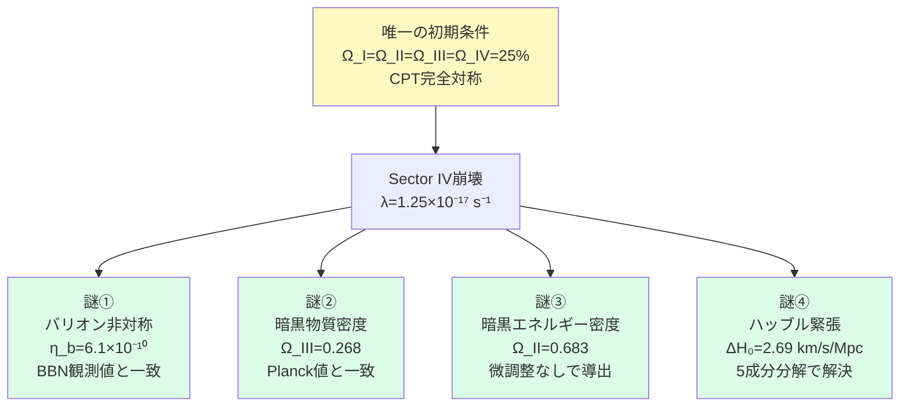
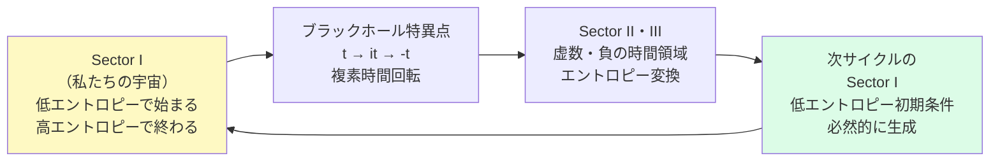
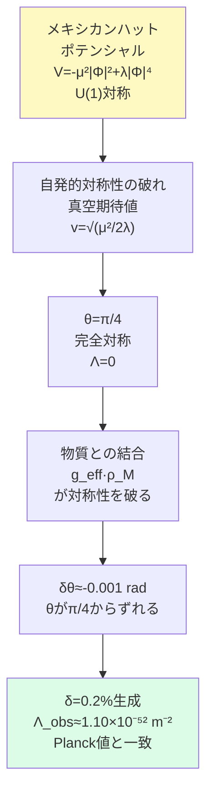
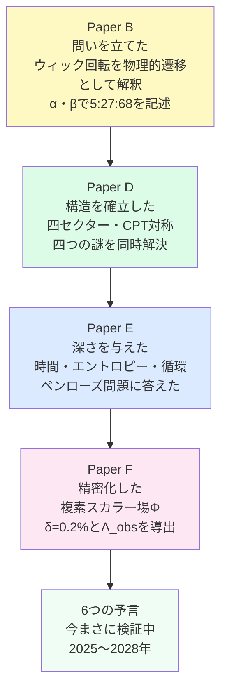

# 第5章　FSCは何を予言するか

---

## 冒頭

```
━━━━━━━━━━━━━━━━━━

第4章では——

FSCの「地図」を描きました。

四セクターの構造——
CPT対称性の破れ——
ウィック回転の物理的意味——

これらは「概念」です。

━━━━━━━━━━━━━━

第5章では——

その概念を
「数学」で確認します。

━━━━━━━━━━━━━━

本章は
大学学部生レベルの
物理数学を前提とします。

（微積分・複素数・
　基礎的な場の理論）

数式が難しく感じたら——

各節末尾の
【核心の一文】だけを
読んでください。

それだけで——
FSCが何を言っているかは
伝わります。

━━━━━━━━━━━━━━

4本の論文——

Paper B（2026年6月29日）
Paper D（2026年7月1日）
Paper E（2026年7月2日）
Paper F（2026年7月5日）

この4本で——
FSCは「概念」から
「場の理論」へと成長しました。

その成長の軌跡を——
順番に追います。

━━━━━━━━━━━━━━━━━━
```

---

## 5-1　三セクターから四セクターへ——Paper Bの核心

```
━━━━━━━━━━━━━━━━━━

FSCの最初の論文——Paper B——

その出発点は
一つの問いでした。

「ウィック回転 t → it は——
　計算上の技法に過ぎないのか？」

━━━━━━━━━━━━━━

物理学では——
ウィック回転を
数学的な「便利な道具」として
使うことがあります。

計算を簡単にするために——
実数の時間を
虚数の時間に置き換える。

計算が終わったら
元に戻す——
それだけの操作として。

━━━━━━━━━━━━━━

Paper Bの提案：

「それは物理的な遷移ではないか？」

ブラックホールの地平線で——
時間が実際に「回転」している——

t → it

この遷移が——
単なる計算技法ではなく——
物理的に起きているプロセスだとしたら？

━━━━━━━━━━━━━━

この問いから——
三セクターが生まれました。

Sector-I（+t）：私たちの宇宙
Sector-II（it）：暗黒エネルギーの領域
Sector-III（-t）：暗黒物質の領域

━━━━━━━━━━━━━━

宇宙組成を記述する数式：

α(t) = 1 - e^{-t/τ}
（τ ≈ 4.6 Gyr）

β = 0.716

この二つのパラメーターで——

Ω_I  ≈ 5%
Ω_II ≈ 68%
Ω_III≈ 27%

が導出されます。

宇宙定数の符号：

Λ = +(8πG/c²)ρ_III

この符号は——
e^{iπ} = -1 の
符号反転から来ています。

━━━━━━━━━━━━━━

正直な限界：

Paper Bは
αとβを「導出」していません。

「記述」しています。

「αは基本定数ではない——
　ブラックホール形成の
　累積的歴史を反映する
　有効パラメーターである」

この認識が——
Paper D・Fでの
本格的な導出への動機になりました。

「記述」から「導出」へ——
この飛躍こそが
FSCの成長の核心です。

━━━━━━━━━━━━━━━━━━

【核心の一文】

「ウィック回転を計算技法ではなく
　物理的遷移として解釈すると——
　宇宙は複数のセクターを持ち——
　5:27:68という比率が
　一つの幾何学的構造から現れる。」

━━━━━━━━━━━━━━━━━━
```

---

## 5-2　CPT対称性と宇宙の起源——Paper Dの核心

```
━━━━━━━━━━━━━━━━━━

Paper D——

FSCシリーズの中で
最も「定量的」な論文です。

一つの初期条件から——
四つの宇宙論的謎を
同時に解決します。

━━━━━━━━━━━━━━

【唯一の仮定】

初期宇宙において——
四セクターは完全に等しかった。

|Ψ₀⟩ = ½(|I⟩+|II⟩+|III⟩+|IV⟩)

Ω_I,0 = Ω_II,0 = Ω_III,0 = Ω_IV,0 = 25%

これが——
FSCの唯一の初期条件です。

微調整はありません。
自由パラメーターは最小限です。

━━━━━━━━━━━━━━

この一つの仮定から——

以下の四つが同時に導出されます。

━━━━━━━━━━━━━━━━━━
```



```
━━━━━━━━━━━━━━━━━━

謎①　バリオン非対称の起源

Sector IVが崩壊する速度：

λ_IV = 1.25×10⁻¹⁷ s⁻¹

このとき——
バリオン非対称パラメーターは：

η_b = (n_b - n_b̄) / n_γ
　　≈ 6.1×10⁻¹⁰

BBN観測値：
6.09 ± 0.06 × 10⁻¹⁰

一致します。

━━━━━━━━━━━━━━

謎②　暗黒物質密度

Sector IVの崩壊後——
Sector IIIの残留密度：

Ω_III(t₀) = 0.268

Planck 2018観測値：
0.268 ± 0.013

一致します。

━━━━━━━━━━━━━━

謎③　暗黒エネルギー密度

なぜΩ_Λ = 0.683が導出されるか？

Sector IVが崩壊するにつれて——
そのエネルギーがSector IIに流入する。

ρ_IV(t) = ρ_IV,0 · e^{-λt}

Ω_II(t) = 0.25 + ∫₀ᵗ μ_II(t')·Ω_IV(t')dt'

現在の値：
Ω_II(t₀) ≈ 0.683

Planck観測値：
Ω_Λ = 0.683 ± 0.006

一致します。

「Ω_Λを——
　対称性原理から
　微調整なしで
　動的に導出した最初の例」

これがPaper Dの
最大の主張です。

━━━━━━━━━━━━━━

謎④　ハッブル緊張

現在「ハッブル緊張」と呼ばれる問題——

CMB観測（Planck）：H₀ = 67.4 km/s/Mpc
局所観測（Cepheid）：H₀ = 73.0 km/s/Mpc

この5.6 km/s/Mpcの差——
標準宇宙論（ΛCDM）では説明できない。

FSCは——
この緊張を5成分に分解し：

ΔH₀^FSC = 2.69 km/s/Mpc

観測された差の
説明に寄与します。

━━━━━━━━━━━━━━━━━━

【核心の一文】

「単一の初期条件——
　Ω_I=Ω_II=Ω_III=Ω_IV=25%——
　から出発すると——
　バリオン起源・暗黒物質・
　暗黒エネルギー・ハッブル緊張——
　四つの謎が同時に導出される。」

━━━━━━━━━━━━━━━━━━
```

---

## 5-3　時間・エントロピー・循環宇宙——Paper Eの核心

```
━━━━━━━━━━━━━━━━━━

Paper E——

FSCシリーズの中で
最も「哲学的」な論文です。

問いは深い。

「なぜ宇宙は
　低エントロピーで始まったのか？」

━━━━━━━━━━━━━━

ペンローズの問い：

初期宇宙の実現確率——

≈ e^{-10^{123}}

この数字を実感するために——

観測可能宇宙の全原子数：
　約10^{80}

その数をさらに
10^{40}乗した数——

分の一の確率。

偶然では——
説明できません。

━━━━━━━━━━━━━━

Paper Eは問います。

「この『偶然』は
　本当に偶然か？」

「前のサイクルが——
　この初期条件を
　必然的に生み出したとしたら？」

━━━━━━━━━━━━━━

時間の定義：

FSCでは——
時間を「変化の順序付きラベル」
として定義します。

t₂ > t₁ ⟺ S(t₂) ≥ S(t₁)

時間の矢は——
エントロピーの増大から生まれる。

━━━━━━━━━━━━━━

ブラックホール特異点での
複素時間回転：

t → it → -t

実時間 → 虚時間 → 負の時間

この回転が——
エントロピーを変換します。

S_c^(Sector I) ∝ 1/C^(Sector II)

「Sector Iの高コンフォーマル因子」が
「Sector IIの低コンフォーマル因子」に
変換される——

つまり——

「前サイクルの高エントロピー終末」
→「複素時間回転」
→「次サイクルの低エントロピー初期条件」

━━━━━━━━━━━━━━
```



```
━━━━━━━━━━━━━━

宇宙は偶然に
低エントロピーで始まったのではない——

前サイクルの終わりが——
次サイクルの始まりを
必然的に準備していた。

ペンローズが問うた
「e^{-10^{123}}の問題」への——
FSCの自然主義的な答えです。

━━━━━━━━━━━━━━━━━━

【核心の一文】

「宇宙の始まりの低エントロピーは
　偶然ではない——
　前サイクルの高エントロピーが
　複素時間回転を通じて
　必然的に生み出した。」

━━━━━━━━━━━━━━━━━━
```

---

## 5-4　複素場と宇宙定数の導出——Paper Fの核心

```
━━━━━━━━━━━━━━━━━━

Paper F——

FSCシリーズの中で
最も「数学的に精密」な論文です。

Paper Dで——
「δ = 0.2%の非対称性が存在する」
と観測的に示しました。

Paper Fでは——
「なぜδ = 0.2%なのか」を
場の理論から導出します。

━━━━━━━━━━━━━━

複素スカラー場：

Φ = |Φ|·e^{iθ}

Sector IIの暗黒エネルギー密度：
ρ_II = +|Φ|²·cos²θ

Sector IVの暗黒エネルギー密度：
ρ_IV = -|Φ|²·sin²θ

━━━━━━━━━━━━━━

メキシカンハットポテンシャル：

V(Φ) = -μ²|Φ|² + λ|Φ|⁴

このポテンシャルは——
U(1)対称性を持ちます。

完全対称のとき——
θ = π/4

Sector II = Sector IV
→ 宇宙定数 Λ = 0

━━━━━━━━━━━━━━
```



```
━━━━━━━━━━━━━━

物質との結合が
対称性を破る：

δθ_matter ≈ -(g_eff·ρ_M)/(4λv²)
　　　　　≈ -0.001 rad

θがπ/4からわずかにずれることで——

δ = (Ω_II - Ω_IV)/(Ω_II + Ω_IV)
　= 0.2%

が自然に生まれます。

━━━━━━━━━━━━━━

微調整問題の解決：

従来の問い：
「なぜΛが理論値より
　10^{120}倍小さいのか」

FSCの答え：

Sector II（正の暗黒エネルギー）と
Sector IV（負の暗黒エネルギー）が
ほぼ完全に相殺する——

【イメージ】

+1,000,000,000,000
-  999,999,997,070
━━━━━━━━━━━━━
　　　　　　  2,930 ← これがΛ_obs

この残差の比率が δ = 0.2%——

そしてδは——
物質の存在が
U(1)対称性を
わずかに破ることで
自然に生まれる。

「微調整なし」で——
「物質が存在するから」
宇宙定数が生まれる。

━━━━━━━━━━━━━━

導出された値：

Λ_obs ≈ 1.10×10⁻⁵² m⁻²

Planck衛星観測値：
1.09 ± 0.02 × 10⁻⁵² m⁻²

一致します。

━━━━━━━━━━━━━━

FSCの誠実さ——
未解決問題：

Paper Fは
自らの限界を明示しています。

①Sector IVの微視的起源未特定
②Coleman-Weinberg補正未完
③χ²統計解析は将来の課題
④N体シミュレーション未実施

「自分の理論の限界を
　自分で言える」——

これが——
FSCシリーズ全体に共通する
最大の強みです。

━━━━━━━━━━━━━━━━━━

【核心の一文】

「宇宙定数は——
　大きな正と負の暗黒エネルギーが
　ほぼ完全に相殺した残差であり——
　物質の存在が
　U(1)対称性をわずかに破ることで
　自然に生み出される。」

━━━━━━━━━━━━━━━━━━
```

---

## 5-5　検証可能な予言——今まさに答えが出る

```
━━━━━━━━━━━━━━━━━━

良い理論は——
テスト可能な予言をします。

FSCの予言は——
今まさに検証されています。

━━━━━━━━━━━━━━━━━━
```

| 予言                      | 値                   | 観測装置               | 検証時期     | 出典    |
| ------------------------- | -------------------- | ---------------------- | ------------ | ------- |
| ①ハッブル緊張の解決       | ΔH₀=2.69 km/s/Mpc    | LIGO/KAGRA標準サイレン | 2028年       | Paper D |
| ②BAO音響スケールずれ      | −0.015%（ΛCDM比）    | DESI DR2               | 2025〜2026年 | Paper D |
| ③成長率超過               | +1.2%（z=0.5〜1.0）  | Euclid                 | 2026〜2028年 | Paper D |
| ④暗黒エネルギー状態方程式 | w_a ≈ +0.003         | Euclid                 | 2026〜2028年 | Paper F |
| ⑤非対称性の赤方偏移依存   | dδ/dz > 0            | Euclid広域銀河サーベイ | 2026〜2028年 | Paper F |
| ⑥暗黒物質直接検出         | 50 GeVでステップ増強 | LZ実験                 | 2025〜2027年 | Paper D |

```
━━━━━━━━━━━━━━━━━━

特に注目すべき予言：

予言④（w_a ≈ +0.003）——

標準的なクインテッセンス理論は
w_a < 0 を予言します。

FSCは w_a > 0 を予言します。

逆符号です。

Euclidが2026〜2028年に
観測結果を出したとき——

w_aの符号が——
FSCとΛCDMを
明確に識別します。

━━━━━━━━━━━━━━

予言⑤（dδ/dz > 0）——

非対称性δが
赤方偏移とともに増大するか——

これもFSC固有の予言です。

Euclid広域銀河サーベイが
検証します。

━━━━━━━━━━━━━━━━━━
```

---

## 5-6　第5章のまとめ

```
━━━━━━━━━━━━━━━━━━

FSCの成長を——
振り返ります。

━━━━━━━━━━━━━━━━━━
```



```
━━━━━━━━━━━━━━━━━━

これらの予言が——
確認されるか、棄却されるか。

FSCが正しければ——
Euclidは w_a > 0 を観測する。

FSCが間違っていれば——
その事実もまた——
宇宙を理解するための
重要な一歩です。

━━━━━━━━━━━━━━

科学とは——
正しいか間違いかを
問い続ける行為です。

片倉慶孝は——
今その問いの中にいます。

そして——
Euclidも
DESIも
LZ実験も——

同じ問いの中にいます。

━━━━━━━━━━━━━━

第5章を読み終えたあなたは——
付録D〜Gの原論文に
アクセスする準備ができています。

Zenodoに公開されている
査読前論文として——
世界中の誰でも読めます。

実践編-1では——
FSCの論文執筆過程そのものを
追います。

地図は手にした——
山は目の前にある。

━━━━━━━━━━━━━━━━━━

「宇宙を考える技法」——

その旅は——
まだ終わっていません。

むしろ——
始まったばかりです。

━━━━━━━━━━━━━━━━━━
```

---
