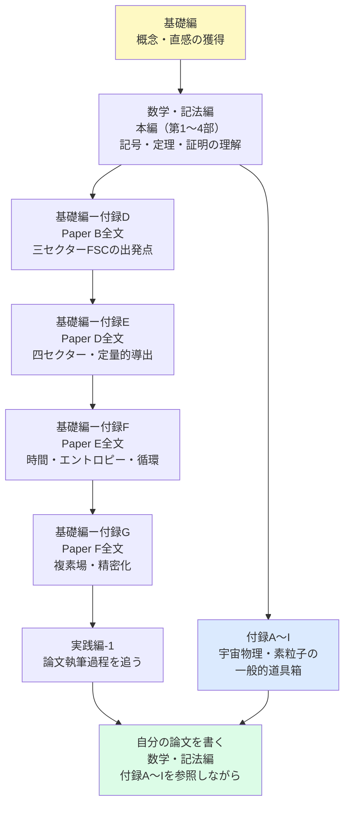

## 付録H　論文執筆の標準構造

「自分の論文を書く」ための実践的な道具箱。

### 物理系論文の標準構造

1. **Title（タイトル）**
   - 具体的な予言値や手法を含む
   - 例：「FSC四セクターモデルによる宇宙定数の動的導出」

2. **Abstract（要旨）**
   - 問い・手法・結果・意義を 150〜250 語で記述
   - 数値を必ず含める

3. **Introduction（序論）**
   - 既存の問題点
   - 本論文の位置づけ
   - 先行研究との関係
   - 本論文の構成

4. **Theoretical Framework（理論的枠組み）**
   - 仮定の明示
   - 数学的定義
   - 先行研究との連続性

5. **Results（結果）**
   - 導出の過程
   - 数値の提示
   - 図表

6. **Discussion（考察）**
   - 結果の解釈
   - 観測との比較
   - 他の理論との比較

7. **Limitations（限界）**
   - 未解決問題の明示
   - 将来の課題
   - ※FSCシリーズが最も誠実な節

8. **Conclusion（結論）**
   - 主要な結果の要約
   - 将来の展望

9. **References（参考文献）**
   - DOI付きで記述

---

### Abstract の書き方（テンプレート）

> 「[既存の問題]は[分野]における未解決の問題である。本論文では[手法]を用いて[結果]を示す。特に[具体的数値]は[観測値]と一致し——[意義]を示す。この結果は[将来の検証方法]によって検証可能である。」

---

### FSCシリーズの Abstract から学ぶ

**Paper Dの例：**

> 「我々はFSCの四セクターモデルが単一の初期条件 $\Omega_I = \Omega_{II} = \Omega_{III} = \Omega_{IV} = 25\%$ から $\eta_b = 6.1 \times 10^{-10}$（BBN一致）、$\Omega_{DM} = 0.268$（Planck一致）、$\Omega_\Lambda = 0.683$（微調整なし）、$\Delta H_0 = 2.69$ km/s/Mpc を同時に導出することを示す。」

- **問い：** 宇宙論的謎の同時解決
- **手法：** 四セクターFSC
- **結果：** 四つの数値
- **意義：** 微調整なし・単一仮定
- **検証：** 将来の観測

この構造を——自分の論文に適用してください。

---

## 付録I　査読プロセスとプレプリント文化

「論文を書いた後」の世界。

### 査読（Peer Review）の流れ

1. 著者が論文をジャーナルに投稿
2. エディターが査読者を選定（通常2〜3名の専門家）
3. 査読者がコメントを返す
4. 著者が修正・反論
5. 採択（Accept）または不採択（Reject）

所要時間：短いもので3ヶ月——長いものは1〜2年。

---

### プレプリントとは

査読前の論文を公開サーバーに即時公開する文化。

| サーバー | 対象分野 |
| --- | --- |
| arXiv | 物理・数学・CS |
| Zenodo | 全分野・DOI付与 |
| bioRxiv | 生物学 |

FSCシリーズは Zenodo で公開されています。

**DOI（Digital Object Identifier）：** プレプリントに付与される永続的な識別子。

例：`10.5281/zenodo.21038702`（Paper B のDOI）

---

### プレプリントの意義

「査読前だから信頼できない」ではありません。

- **速報性：** 発見を即時共有
- **透明性：** 誰でも読める
- **反証可能性：** 世界中からコメントが来る

FSCシリーズが Zenodo で公開されている意味——

「世界中の研究者に今すぐ読んでほしい」「批判を歓迎する」という姿勢の表れです。

---

### 自分の論文を投稿するとき

1. **Zenodo への登録**
   - 無料
   - DOI が即時付与
   - バージョン管理可能

2. **arXiv への投稿**
   - 物理系の標準的プレプリント
   - モデレーション（数日かかる）

3. **ジャーナルへの投稿**
   - Physical Review Letters（PRL）
   - JCAP（Journal of Cosmology and Astroparticle Physics）
   - など

---

## 付録J　FSC論文を読む順序

「次に何を読むか」のロードマップ。

