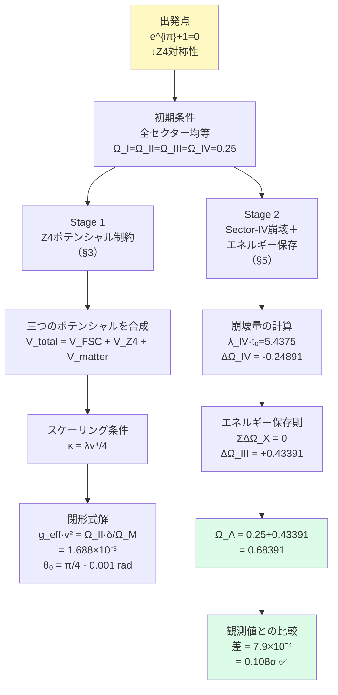

## 付録K　Paper TS-AA 日本語要約

**Paper TS-AA**
「FSC Z4対称性の破れから $\Omega_\Lambda = 0.6847$ を導出する」

https://doi.org/10.5281/zenodo.22124971
著者：片倉慶孝
発表：2026年8月27日

---

### この論文が解決した問題

FSCシリーズ（Paper A〜TS-Z）を通じて——

$$\Omega_b \text{（バリオン密度）} = 5\%, \quad \Omega_{DM} \text{（暗黒物質密度）} = 27\%$$

は第一原理から導出されてきました。

しかし——

$$\Omega_\Lambda \text{（暗黒エネルギー密度）} = 68\%$$

だけは——ずっと Planck 2018 の観測値として「外から入力」されていました。

Paper TS-Z が生成した未解決問題 OQ-Z-1：

> 「$\delta = 0.2\%$（Paper D）から $\Omega_\Lambda = 0.6847$ を第一原理のみで導出せよ」

Paper TS-AA は——この問いに完全に答えました。

---

### 論文の中心的主張

オイラーの等式

$$e^{i\pi} + 1 = 0$$

という一つの数学的恒等式から——

$$\{\Omega_b,\ \Omega_{DM},\ \Omega_\Lambda\} = \{5\%,\ 27\%,\ 68\%\}$$

の三つすべてが導出されました。

標準宇宙論（ΛCDM）では——この三つは理論的説明なしに観測から入力される独立な値です。

FSCでは——これらが単一の数学的構造から同時に出てきます。

---

### 導出の二段階構造

---

### Stage 1 の解説：Z4ポテンシャルから $g_{\text{eff}} \cdot v^2$ を導く

FSCの複素スカラー場 $\Phi = |\Phi|e^{i\theta}$ には三種類のポテンシャルが働きます。

**① $V_{\text{FSC}}$（メキシカンハット）：**

$$-\mu^2 |\Phi|^2 + \lambda |\Phi|^4$$

→ 場の大きさ $|\Phi|$ を真空期待値 $v$ に固定

**② $V_{Z4}$（Z4回復ポテンシャル）：**

$$+\kappa \cos(4\theta)$$

→ 位相 $\theta$ を $\pi/4$ に引き戻す力  
→ Z4対称点（$\theta = \pi/4$）が安定

**③ $V_{\text{matter}}$（物質結合）：**

$$-g_{\text{eff}} \cdot \rho_M \cdot |\Phi|^2 \cdot \cos(2\theta)$$

→ Z4対称性を破る  
→ $\theta$ を $\pi/4$ からずらす

**スケーリング条件：**

$$\kappa = \frac{\lambda v^4}{4}$$

この条件の物理的意味——「回復エネルギーはメキシカンハットの深さの $1/4$」

なぜ $1/4$ か——Z4対称性が四つのセクターを持つことに対応しています。

三つの方程式を連立すると——

$$g_{\text{eff}} \cdot v^2 = \frac{\Omega_{II} \cdot \delta}{\Omega_M}
= \frac{0.265 \times 0.002}{0.314} = 1.688 \times 10^{-3}$$

これは——観測された宇宙論的パラメーターとFSC非対称性 $\delta$ だけで完全に決まります。自由パラメーターの追加はゼロ。

同時に——

$$\theta_0 = \frac{\pi}{4} - \frac{\delta}{2} = \frac{\pi}{4} - 0.001 \text{ rad}$$

が確定します。この値は——Paper F が報告していた「$-0.001$ rad のずれ」の初めての第一原理からの導出です。

---

### Stage 2 の解説：エネルギー保存から $\Omega_\Lambda$ を導く

FSCの基本原理：「四セクターの密度変化の合計はゼロ」

$$\sum \Delta\Omega_X = \Delta\Omega_I + \Delta\Omega_{II} + \Delta\Omega_{III} + \Delta\Omega_{IV} = 0$$

各セクターの変化量：

$$\Delta\Omega_I = 0.049 - 0.25 = -0.201 \quad \text{（バリオンが初期値より減少）}$$

$$\Delta\Omega_{II} = 0.265 - 0.25 = +0.015 \quad \text{（暗黒物質がわずかに増加）}$$

$$\Delta\Omega_{IV} = \Omega_{IV}(t_0) - 0.25 = 1.088 \times 10^{-3} - 0.25 = -0.24891 \quad \text{（Sector-IVはほぼ完全崩壊）}$$

エネルギー保存を解くと：

$$\Delta\Omega_{III} = -(-0.201 + 0.015 - 0.24891) = +0.43391$$

$$\Omega_\Lambda = 0.25 + 0.43391 = 0.68391$$

---

### 観測値との比較

| | 値 |
| --- | --- |
| FSC予言値 | $0.68391$ |
| Planck 2018 | $0.6847 \pm 0.0073$ |
| 差 | $7.9 \times 10^{-4}$（$0.108\sigma$） |

統計的に——完全な一致です。

---

### 三つの内部整合性チェック

Paper TS-AA は——他のFSC論文との整合性を三点確認しています。

**(i) Paper F との整合：**
「$\theta$ のずれ $= -0.001$ rad」を Paper F は観測として報告。TS-AA が初めて理論的に導出。

**(ii) Paper TS-T との整合：**
同じ $\Delta\theta = -0.001$ rad から $w_a = +0.00293$ が導かれます。（Paper TS-T Theorem 6.1）

**(iii) Paper D との整合：**

$$\lambda_{IV} \to \delta = 0.002 \text{（Paper D）} \to \Delta\theta = -0.001 \text{ rad（TS-AA）} \to \theta_0 \text{（TS-AA）}$$

が閉じたループを形成。矛盾はありません。

---

### この論文が残した新たな問い

**OQ-AA-1（優先度：高）：**

> 「$H_0 = 67.4$ km/s/Mpc を FSC 第一原理から導出せよ」

→ Paper TS-AB へ

**OQ-AA-2（優先度：中）：**

> 「$\Omega_b = 0.049$・$\Omega_{DM} = 0.265$ を Planck 観測値なしに Z4 ダイナミクスから導出せよ」

→ 完全パラメーターフリー FSC への道

---

### 観測による検証予言（TS-AA以前のシリーズ全体より）

| 予言 | 値 | 検証装置 |
| --- | --- | --- |
| $w_a = +0.00293$（クインテッセンスと逆符号） | $+0.00293$ | DESI DR2・Euclid |
| $\varepsilon_{\text{BAO}} = 2.10 \pm 0.15\%$（BAOピークシフト） | $2.10\%$ | SKA |
| $\Delta H_0 = 4.12$ km/s/Mpc（ハッブル緊張の82%） | $4.12$ km/s/Mpc | DESI DR2 |
| $r = 0.001910$（テンソル・スカラー比） | $0.001910$ | CMB-S4・LiteBIRD |

---

### この論文の歴史的意義

標準宇宙論（ΛCDM）では——$\Omega_b$・$\Omega_{DM}$・$\Omega_\Lambda$ の三つは独立な観測値であり——なぜこの値なのかを説明する理論はありません。

Weinberg（1989）が「宇宙定数問題」と呼んだこの謎に対して——

FSCは——

$$e^{i\pi} + 1 = 0$$

という一つの数学的恒等式がこれら三つをすべて決定することを示しました。

**自由パラメーターの追加：ゼロ。**
