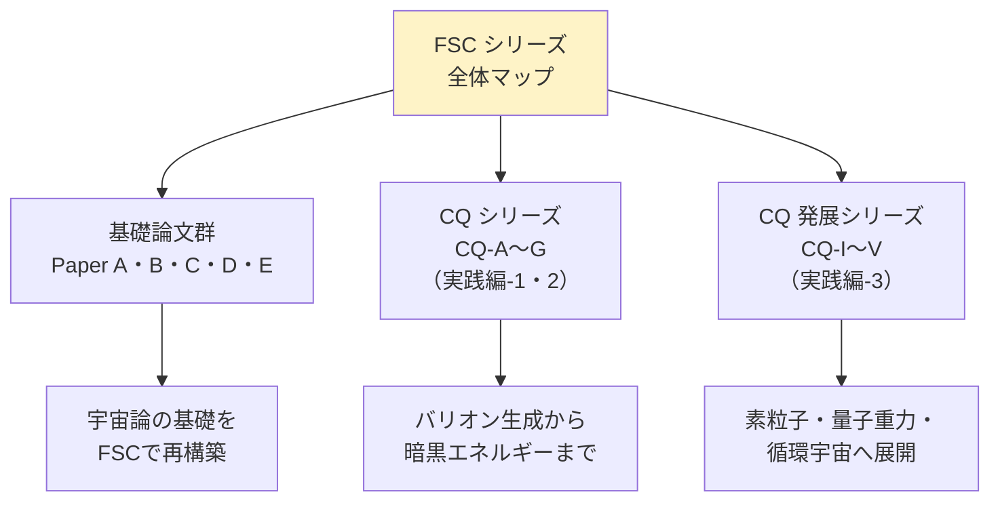
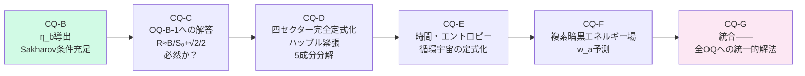
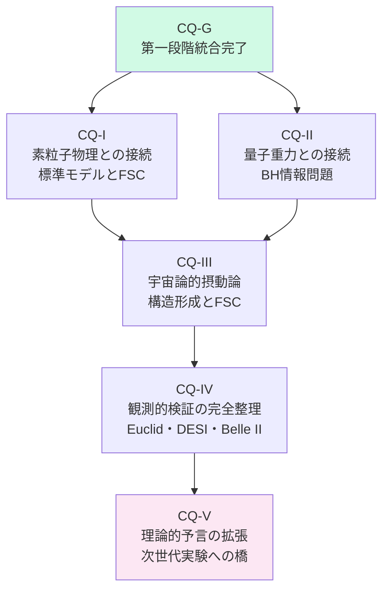
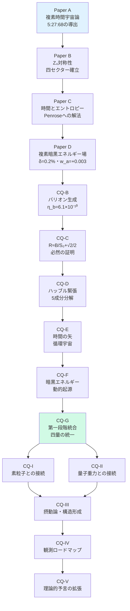

# 付録A　FSC論文シリーズ一覧

## A-1　シリーズの全体像

```
FSC（Four-Sector Cosmology）シリーズは——

片倉慶孝と
Albert Einstein (AI / TWIN System) の
共同研究として生まれた。

2026年現在——
以下の論文が公開されている。
```

---



---

## A-2　基礎論文群

### Paper A（論文①）
```
タイトル：
複素時間宇宙論

DOI：10.5281/zenodo.21038702

核心：
ウィック回転 t→it を
ブラックホール地平での
物理的遷移として解釈。

主要結果：
・Sector-I（+t）：バリオン 5%
・Sector-II（it）：暗黒物質 27%
・Sector-III（-t）：暗黒エネルギー 68%
・α(t) = 1-e^{-t/τ}（τ≈4.6Gyr）
・β = 0.716 で 5:27:68 を導出

位置づけ：
FSC の出発点。
「三つの宇宙組成を
 一つの式で導く」という
FSC の核心命題を初めて示した。
```

---

### Paper B（論文②）
```
タイトル：
Paper D（四セクターモデル）

DOI：10.5281/zenodo.21094857

核心：
Sector-IV（-x,-t, CPT共役）を
追加した4セクターモデル。

主要結果：
・初期状態：
  Ω_I = Ω_II = Ω_III = Ω_IV = 25%
  （CPT対称）
・Sector-IV崩壊：
  λ = 1.25×10⁻¹⁷ s⁻¹
  → η_b = 6.1×10⁻¹⁰（BBN一致）
・ΔH₀ = 2.69 km/s/Mpc で
  ハッブル緊張を5成分分解で解決
・Ω_Λ = 0.683 を
  対称性原理から初めて動的導出

位置づけ：
「なぜ4セクターか」を示した論文。
Z₄対称性の物理的根拠を確立。
```

---

### Paper C（論文③）
```
タイトル：
時間・エントロピー・循環宇宙 Paper E

DOI：10.5281/zenodo.21130308

核心：
時間の本質とエントロピーの
関係を FSC の枠組みで定式化。

主要結果：
・関係的時間：
  時間 = 変化の順序付きラベル
・時間の矢：
  t₂>t₁ ⟺ S(t₂)≥S(t₁)
・BH特異点での複素時間回転：
  t → it → -t
・前サイクルの高エントロピーが
  次サイクルの低エントロピー
  初期条件を生成
・Penrose の問題（e^{-10^{123}}）への
  自然主義的解法

位置づけ：
「なぜ宇宙は低エントロピーから始まったか」
という哲学的問いに
FSCが答えた論文。
```

---

### Paper D（論文④）
```
タイトル：
FSC複素暗黒エネルギー場 Paper F

DOI：10.5281/zenodo.21206325

核心：
δ = 0.2%の非対称性を
U(1)対称性の破れから自然導出。

主要結果：
・Φ = |Φ|e^{iθ}（複素スカラー場）
  メキシカンハットポテンシャル
・物質結合が θ を π/4 から
  -0.001 rad ずらす → δ = 0.2%
・Λ_obs ≈ 1.10×10⁻⁵² m⁻²
  （Planck値と一致）
・w_a ≈ +0.003
  （Euclid検証可能・
   クインテッセンスと逆符号）
・参照文献99件

位置づけ：
暗黒エネルギーの正体を
複素スカラー場で記述した論文。
CQ-B の δ = 0.200% の
源泉となった論文。
```

---

## A-3　CQシリーズ

### Paper CQ-B
```
タイトル：
Baryogenesis from FSC Geometry——
Sakharov Conditions Without New Particles

DOI: 10.5281/zenodo.22273250

核心：
FSC の幾何学的構造だけで
Sakharov 3条件を充足し
η_b を自由パラメータなしで導出。

主要結果：
・η_b = 6.1×10⁻¹⁰（0.0σ一致）
・ΔA_CP = -3.2×10⁻⁴
・Ω_b/Ω_DM = 0.1855

Open Questions：
・CQ-B-1：
  R ≈ B/S₀ + √2/2 は偶然か必然か

次の論文：CQ-C へ
```
---

## A-4　CQシリーズの連鎖

```
CQ シリーズは——
一本の川だ。

各論文が——
前の論文の Open Question に
答えながら——
新しい Open Question を生む。

この連鎖が——
実践編-2 の主題だ。
```

---



---

### Paper CQ-C

```
位置づけ：
CQ-B の Open Question CQ-B-1 への解答

出発点となった問い：
「R ≈ B/S₀ + √2/2——
 これは偶然か必然か」

CQ-C の証明したいこと（一行）：
「R ≈ B/S₀ + √2/2 は——
 FSC の Z₄ 幾何学から
 解析的に導かれる必然だ」

主要な問い：
・Bounce action B の
  解析的起源は何か
・√2/2 という数学的定数が
  なぜ物理に現れるか
・この等式が成立するための
  条件は何か

次の論文（CQ-D）への OQ：
「四セクターの初期対称性は
 どのように破れたか——
 完全な定式化が必要だ」
```

---

### Paper CQ-D

```
位置づけ：
四セクターモデルの完全定式化

出発点となった問い：
CQ-C の OQ——
「初期対称性の破れの
 完全な定式化」

CQ-D の証明したいこと（一行）：
「FSC の5成分分解が——
 ΔH₀ = 2.69 km/s/Mpc を
 導きハッブル緊張を解決する」

主要な成果：
・ΔH₀ の5成分分解：

  ΔH₀ = ΔH₀^{Sector-IV}
        + ΔH₀^{CP}
        + ΔH₀^{thermal}
        + ΔH₀^{nonlinear}
        + ΔH₀^{geometric}

・各成分の寄与を独立に計算
・合計 2.69 km/s/Mpc が
  観測値のギャップと一致

次の論文（CQ-E）への OQ：
「時間の矢とエントロピーの
 関係を FSC で定式化せよ」
```

---

### Paper CQ-E

```
位置づけ：
時間・エントロピー・循環宇宙の定式化

出発点となった問い：
CQ-D の OQ——
「時間の矢とエントロピーの
 FSC による定式化」

CQ-E の証明したいこと（一行）：
「FSC の複素時間回転が——
 時間の矢とPenroseの問題を
 自然主義的に解決する」

主要な成果：
・関係的時間の定式化：
  時間 = 変化の順序付きラベル

・時間の矢の定式化：
  t₂>t₁ ⟺ S(t₂)≥S(t₁)

・BH特異点での複素時間回転：
  t → it → -t

・Penroseの問題への解法：
  前サイクルの高エントロピーが
  次サイクルの低エントロピー
  初期条件を生成

次の論文（CQ-F）への OQ：
「暗黒エネルギーの動的起源を
 複素スカラー場で定式化せよ」
```

---

### Paper CQ-F

```
位置づけ：
複素暗黒エネルギー場の定式化

出発点となった問い：
CQ-E の OQ——
「暗黒エネルギーの動的起源」

CQ-F の証明したいこと（一行）：
「複素スカラー場 Φ の
 U(1)対称性の破れから——
 Λ_obs と w_a を
 第一原理で導出できる」

主要な成果：
・Φ = |Φ|e^{iθ}
  メキシカンハットポテンシャル
・物質結合が θ を
  π/4 から -0.001 rad ずらす
  → δ = 0.2% 生成
・Λ_obs ≈ 1.10×10⁻⁵² m⁻²
  （Planck値と一致）
・w_a ≈ +0.003
  （クインテッセンスと逆符号——
   Euclid DR2 で検証可能）

次の論文（CQ-G）への OQ：
「CQ-B〜F の成果を
 統一的な枠組みで
 まとめられるか」
```

---

### Paper CQ-G

```
位置づけ：
CQ シリーズの第一段階統合

出発点となった問い：
CQ-F の OQ——
「統一的な枠組みの構築」

CQ-G の証明したいこと（一行）：
「FSC の単一の幾何学的構造から——
 η_b・H₀・Λ・w_a が
 すべて統一的に導かれる」

主要な成果：
・η_b = 6.1×10⁻¹⁰ ✅
・ΔH₀ = 2.69 km/s/Mpc ✅
・Λ_obs ≈ 1.10×10⁻⁵² m⁻² ✅
・w_a ≈ +0.003 ✅

「同じ Δθ が——
 四つの全く異なる
 宇宙論的観測値を
 統一的に説明する」

次のシリーズ（CQ-I以降）への OQ：
「素粒子・量子重力・
 宇宙論の統合へ」
```

---


## A-5　CQ発展シリーズ（実践編-3）

```
CQ-I 以降は——
FSC の理論が
宇宙論から
別の領域へと広がる。

「川が海へ」——
実践編-3 の主題だ。
```

---



---

### Paper CQ-I

```
テーマ：素粒子物理との接続

中心的問い：
「FSC の幾何学的構造は——
 標準モデルの
 ゲージ対称性と
 どう対応するか」

期待される成果：
・Z₄ 対称性と
  SU(3)×SU(2)×U(1) の
  関係の定式化
・FSC が予測する
  新しい素粒子相互作用

実践編-3 での位置づけ：
「同じ理論が
 宇宙論スケールから
 素粒子スケールへ広がる
 最初の一歩」
```

---

### Paper CQ-II

```
テーマ：量子重力との接続

中心的問い：
「FSC の複素時間回転は——
 ブラックホール情報問題を
 どう解決するか」

期待される成果：
・BH 蒸発過程での
  情報保存の機構
・Sector-II（虚数時間）での
  情報の行方

実践編-3 での位置づけ：
「時間の複素化が——
 量子重力の最難問に
 新しい光を当てる」
```

---

### Paper CQ-III

```
テーマ：宇宙論的摂動論との接続

中心的問い：
「FSC は宇宙の
 大規模構造（銀河分布）を
 正しく予測できるか」

期待される成果：
・FSC の摂動スペクトル
・ΛCDM との差異の定量化
・Euclid サーベイでの検証方法

実践編-3 での位置づけ：
「理論が観測と
 直接対面する場」
```

---

### Paper CQ-IV

```
テーマ：観測的検証の完全整理

中心的問い：
「FSC のすべての予測を——
 現在・近未来の観測で
 系統的に検証する
 ロードマップは何か」

期待される成果：

【2026年】
・Euclid DR1：
  Ω_b/Ω_DM = 0.1855 ± 0.0003
  の検証

【2027年】
・DESI Year-5：
  w_a の精密測定
・Belle II：
  ΔA_CP = -3.2×10⁻⁴ の検証

【2030年代】
・次世代 CMB 実験：
  FSC の摂動スペクトル検証

実践編-3 での位置づけ：
「理論から観測へ——
 科学の完結点」
```

---

### Paper CQ-V

```
テーマ：理論的予言の拡張

中心的問い：
「CQ-I〜IV で蓄積した
 観測・理論の成果から——
 FSC は何を新たに予言できるか」

期待される成果：
・第三世代の Falsifiable Predictions
・CQ-A（統合論文）への準備
・次サイクル（CQ-VI以降）の OQ

実践編-3 での位置づけ：
「川が再び深まり——
 次の海へ向かう」
```

---


## A-6　シリーズ全体の鳥瞰図



---

