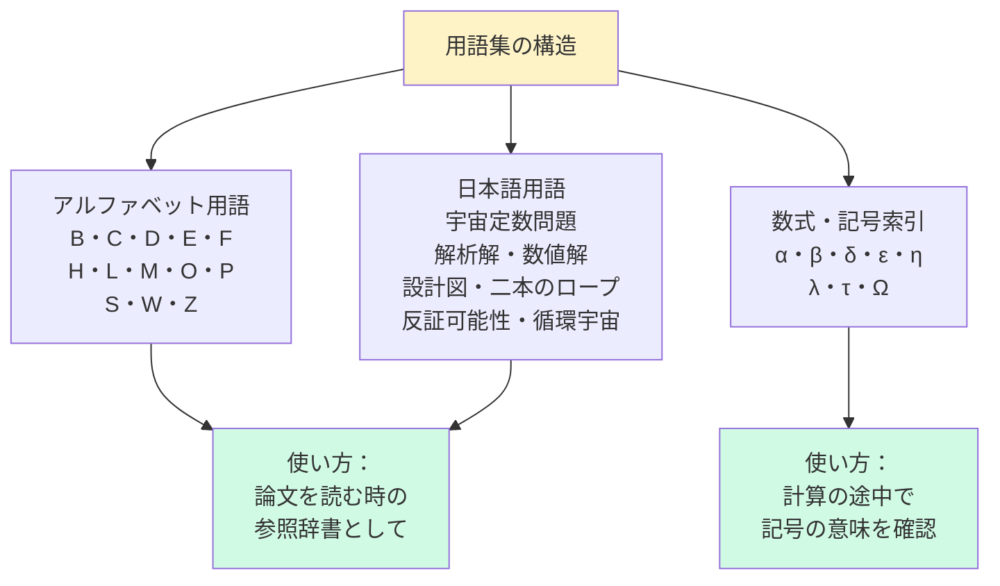

---
title: "付録C　用語集"
---

# 付録C　用語集

## C-1　用語集の使い方

```
この用語集は——
本書に登場する専門用語を
「使える形で」説明したものだ。

辞書的な定義ではなく——
「この言葉が
 論文のどの場面で
 どう機能するか」

を意識して書いた。

アルファベット順——
次いで日本語五十音順で並べた。
```

---

## C-2　アルファベット用語

---

### B

**Baryogenesis（バリオン生成）**
```
宇宙初期に——
物質（バリオン）が
反物質より
わずかに多く生成された過程。

η_b = 6.1×10⁻¹⁰ という
「10億個に1個の偏り」が
現在の宇宙を作った。

CQ-B の中心テーマ。

関連：Sakharov条件、η_b
```

---

**BBN（Big Bang Nucleosynthesis）**
```
ビッグバン元素合成。

宇宙誕生後 3分〜20分の間に——
水素・ヘリウム・リチウムが
合成された過程。

η_b の観測値は
BBN の計算から得られる。

FSC の η_b = 6.1×10⁻¹⁰ は
BBN の観測値と一致する。

関連：η_b、Sakharov条件
```

---

**Bounce Action（B）**
```
宇宙のトンネル効果を
記述する作用積分。

CQ-B の Open Question で登場：
R ≈ B/S₀ + √2/2

B = ln(Mpl/H₀) ≈ 138.5

この値が
Planck 質量と Hubble 定数の
対数比として自然に現れる。

関連：Open Question CQ-B-1
```

---

### C

**C_FSC（FSC幾何学因子）**
```
FSC の Z₄ 構造から来る
補正因子。

C_FSC = e^{-x}(x²+2x+2) / (λ_IV × t₀)²
      = 0.0671

解析解と数値解が
完全に一致した——
「二本のロープ」の実例。

関連：二本のロープ、η_b
```

---

**CP対称性の破れ**
```
物質と反物質の振る舞いに
差が生じること。

Sakharov条件S2に対応。

FSC では——
複素スカラー場 Φ の位相 θ が
π/4 から -0.001 rad ずれることで
δ = 0.200% の CP非対称が生まれる。

関連：Sakharov条件、δ、Δθ
```

---

**CPT対称性**
```
C（電荷共役）×
P（空間反転）×
T（時間反転）

の複合対称性。

相対論的量子場理論では
CPT対称性は必ず保存される。

FSC の Sector-IV は
CPT共役セクターとして定義される。

関連：Sector-IV、Z₄対称性
```

---

### D

**DESI（Dark Energy Spectroscopic Instrument）**
```
暗黒エネルギーを観測する
大規模銀河サーベイ。

FSC の予測：
w_a ≈ +0.003

DESI Year-5（2027年頃）で
検証可能。

クインテッセンス（w_a < 0）と
逆符号であることが——
FSC の決定的な予言。

関連：w_a、Falsifiable Predictions
```

---

**DOI（Digital Object Identifier）**
```
論文を永続的に識別する
デジタル番号。

形式：10.XXXX/XXXXX

確認手順：
https://doi.org/[DOI番号]
をブラウザで開き
論文ページが表示されることを確認。

論文を引用する際は
DOI の正確さを
必ず最後に確認せよ。

FSC論文の例：
Paper A：10.5281/zenodo.21038702
Paper B：10.5281/zenodo.21094857
Paper C：10.5281/zenodo.21130308
Paper D：10.5281/zenodo.21206325

関連：References、Zenodo
```

---

### E

**Euclid（衛星）**
```
ESA の宇宙望遠鏡。

暗黒物質・暗黒エネルギーの
大規模構造を観測。

FSC の予測：
・Ω_b/Ω_DM = 0.1855
  Euclid DR1（2026年）で検証
・w_a ≈ +0.003
  Euclid DR2 で検証

関連：Falsifiable Predictions、w_a
```

---

### F

**Falsifiable Predictions（反証可能な予言）**
```
「この観測結果が出れば
 理論は誤りだ」
という条件を含む予言。

ポパーの科学哲学の核心：
「反証可能でない理論は科学ではない」

良い Predictions の三要件：
① 具体的な数値
② 実験装置・時期の明示
③ 死亡条件（何が出れば誤りか）

関連：ポパー、死亡条件
```

---

**FSC（Four-Sector Cosmology）**
```
四セクター宇宙論。

片倉慶孝と
Albert Einstein (AI) の共同研究。

四つのセクター：
Sector-I（+t）：バリオン 5%
Sector-II（it）：暗黒物質 27%
Sector-III（-t）：暗黒エネルギー 68%
Sector-IV（-x,-t）：CPT共役

ε = 0.002 という
唯一のパラメータから——
宇宙の組成 5:27:68 を
第一原理で導く。

関連：セクター、ε、Z₄対称性
```

---

### H

**Hubble Tension（ハッブル緊張）**
```
宇宙の膨張速度 H₀ の
観測値の矛盾。

CMB から：H₀ ≈ 67.4 km/s/Mpc
局所観測：H₀ ≈ 73.0 km/s/Mpc

差：約 5σ（深刻な矛盾）

FSC Paper B の解法：
ΔH₀ = 2.69 km/s/Mpc を
5成分分解で説明。

関連：Paper B、5成分分解
```

---

### L

**λ_IV（Sector-IV崩壊速度）**
```
Sector-IV が崩壊する速度定数。

λ_IV = 1.25×10⁻¹⁷ s⁻¹

熱非平衡の条件：
λ_IV > H₀ = 2.18×10⁻¹⁸ s⁻¹

λ_IV / H₀ ≈ 5.7 > 1 ✅

Sakharov条件S3の充足を保証。

関連：Sakharov条件S3、熱非平衡
```

---

**Λ（宇宙定数）**
```
アインシュタイン方程式の
定数項。

暗黒エネルギーの密度を表す。

観測値：
Λ_obs ≈ 1.10×10⁻⁵² m⁻²

FSC での導出：
Λ = +(8πG/c²)ρ_III
  = e^{iπ}=-1 の符号反転から

「最大の失敗」と呼んだ
この定数が——
FSC では幾何学的に導かれる。

関連：e^{iπ}+1=0、Sector-III
```

---

### M

**Mermaid図**
```
テキストで書ける
フローチャート・図表ツール。

Zenn・GitHub で
そのまま表示される。

本書での使い方：
・論文の構造を可視化
・因果関係を示す
・計算の流れを追う

基本構文：
flowchart TD
  A[概念A] --> B[概念B]

関連：設計図、論文構造
```

---

### O

**Open Question（OQ）**
```
論文の Discussion の末尾に
登録する「次の問い」。

機能：
① 現論文の限界を正直に示す
② 次の論文の出発点になる
③ 科学の連鎖を可能にする

書き方の三要素：
・問いの明示（疑問文で）
・なぜ重要か
・現時点での障壁

CQ-B の実例：
OQ CQ-B-1：
「R ≈ B/S₀ + √2/2 は偶然か必然か」
→ CQ-C の出発点になった

関連：Discussion、論文の連鎖
```

---

### P

**Penrose の問題**
```
「なぜ宇宙は低エントロピーから
 始まったのか」という問い。

Roger Penrose が提示した。

確率：e^{-10^{123}}
（ほぼゼロ——なぜ実現したのか）

FSC Paper C の解法：
前サイクルの高エントロピーが
次サイクルの低エントロピー
初期条件を生成する——
循環宇宙仮説による自然主義的解法。

関連：Paper C、循環宇宙、エントロピー
```

---

**Planck（衛星）**
```
ESA の宇宙マイクロ波背景放射
（CMB）観測衛星。

2020年のデータが
現在の宇宙論の基準となっている。

FSC が一致を示す主要な値：
・Ω_b = 0.0493
・Ω_DM = 0.265
・Ω_Λ = 0.683
・H₀ = 67.4 km/s/Mpc

関連：References（最新文献の例）
```

---

### S

**Sakharov条件**
```
バリオン非対称を生成するための
必要条件。

Andrei Sakharov (1967) が提示。

S1：B数非保存
S2：CP対称性の破れ
S3：熱非平衡

CQ-B は——
この三条件すべてを
FSC の幾何学的構造だけで充足した。

関連：CQ-B、η_b、Baryogenesis
```

---

### W

**w_a（状態方程式パラメータ）**
```
暗黒エネルギーの
時間依存を表すパラメータ。

w(a) = w₀ + w_a(1-a)

FSC の予測：
w_a ≈ +0.003

注意：
クインテッセンスモデル：w_a < 0
FSC：w_a > 0（逆符号）

この符号の違いが——
Euclid DR2 での
FSC の決定的な検証点になる。

関連：DESI、Euclid、Falsifiable Predictions
```

---

### Z

**Z₄対称性**
```
位数4の巡回群。

Z₄ = {1, i, -1, -i}
     = {e^{0}, e^{iπ/2}, e^{iπ}, e^{i3π/2}}

FSC の4つのセクターが
この対称性を持つ。

物理的意味：
Sector-I → II → III → IV → I
という循環が——
宇宙の4セクター構造を
幾何学的に正当化する。

関連：FSC、循環宇宙、e^{iπ}+1=0
```

**Zenodo**
```
CERN が運営する
オープンアクセス論文リポジトリ。

特徴：
・無料で論文を公開できる
・DOI が即座に付与される
・バージョン管理が可能

FSC 論文はすべて
Zenodo で公開されている。

使い方（基本）：
① zenodo.org にアクセス
② アカウント作成
③ Upload → New Upload
④ PDF・タイトル・著者を入力
⑤ Publish → DOI が発行される

関連：DOI、arXiv、References
```

---

## C-3　日本語用語

---

**宇宙定数問題**
```
理論値と観測値の差：
10¹²⁰ 倍

物理学史上最大の不一致。

FSC では——
Λ を「外から入れる定数」として
扱うのではなく——
幾何学的構造から
自然に導出することで
この問題に新しい視点を与えた。

関連：Λ、自然さ
```

---

**解析解**
```
手計算・代数的操作で
導かれる「式の形の答え」。

例：
C_FSC = e^{-x}(x²+2x+2) / (λ_IV × t₀)²

特徴：
・物理的構造が見える
・パラメータへの依存が明確
・近似の限界がわかる

「地図」として機能する。

対語：数値解
関連：二本のロープ
```

---

**関係的時間**
```
「時間は変化の順序付きラベルだ」
という時間の定義。

FSC Paper C の核心概念。

時間の矢：
t₂ > t₁ ⟺ S(t₂) ≥ S(t₁)

時間は「絶対的な流れ」ではなく——
エントロピーの増大と
不可分に結びついている。

関連：Paper C、時間の矢、エントロピー
```

---

**暗黒エネルギー**
```
宇宙の加速膨張を引き起こす
未知のエネルギー。

観測値：Ω_Λ = 0.683

FSC では——
Sector-III（-t）が
暗黒エネルギーに対応する。

宇宙定数 Λ の符号が——
e^{iπ} = -1 の符号反転から
幾何学的に導かれる。

関連：Sector-III、Λ、Paper D
```

---

**暗黒物質**
```
重力は感じるが
光を出さない未知の物質。

観測値：Ω_DM = 0.265（27%）

FSC では——
Sector-II（it、虚数時間領域）が
暗黒物質に対応する。

新しい粒子（WIMP等）を
仮定せずに——
虚数時間という
幾何学的構造で説明する。

関連：Sector-II、Ω_DM
```

---

**死亡条件**
```
「この観測結果が出れば
 自分の理論は誤りだ」
という条件。

Falsifiable Predictions の
最も重要な要素。

CQ-B の実例：
「Ω_b/Ω_DM が 0.185 から
 0.1% 以上ずれたら——
 FSC は誤りだ」

死亡条件を書ける研究者だけが——
科学の共同体から信頼される。

関連：Falsifiable Predictions、ポパー
```

---

**数値解**
```
具体的な数値を代入して
計算で得られる答え。

例：
x = 0.394 を代入して
C_FSC = 0.0671

特徴：
・具体的な値が得られる
・計算ミスの発見に役立つ
・近似の精度が確認できる

「GPS」として機能する。

対語：解析解
関連：二本のロープ
```

---

**設計図**
```
論文を書き始める前に描く
「論文全体の構成計画」。

核心：
「証明したいことを一行で書く」
→ 逆算で各 Section を決める
→ 各 Section に「一文」を割り当てる

設計図のない論文は——
書きながら迷子になる。

関連：教本ネタ#58、第1章1-2
```

---

**線形近似**
```
非線形な関係を
「小さい変化の範囲で
 直線で近似する」技法。

例：
δ の計算（線形近似）：
δ = √2 × |Δθ| = 0.141%

限界：
非線形効果が大きい場合——
30% 程度の誤差が生じる。

CQ-B では——
この限界を Remark として
正直に記録した。

関連：δ、Remark、二本のロープ
```

---

**循環宇宙**
```
宇宙が誕生・膨張・収縮・再誕生を
繰り返すという仮説。

FSC Paper C の核心：

前サイクルの高エントロピーが
次サイクルの低エントロピー
初期条件を生成する。

4セクターが 2π 回転することで——
宇宙の循環が
幾何学的に記述される。

Penrose の問題への
自然主義的解法を与える。

関連：Paper C、エントロピー、Penrose
```

---

**二本のロープ**
```
解析的アプローチと
数値的アプローチを
平行して走らせる技法。

教本ネタ #57（= 本書 第1章1-3）

一致した時：安心して前進できる
不一致の時：近似の限界を発見できる

どちらも価値がある。

関連：解析解、数値解、C_FSC
```

---

**反証可能性**
```
「理論が間違っていることを
 原理的に示せること」

カール・ポパーが提唱した
科学の条件。

反証可能でない理論は——
どんなに美しくても
科学ではない。

FSC はすべての主要な予測に
「死亡条件」を明記している。

関連：ポパー、Falsifiable Predictions、死亡条件
```

---

**複素スカラー場**
```
複素数値をとるスカラー場。

Φ = |Φ|e^{iθ}

FSC Paper D（Paper F）の核心：

メキシカンハットポテンシャルに従い——
物質結合が θ を
π/4 から -0.001 rad ずらす。

→ δ = 0.200% の CP非対称を生成

関連：Paper D、δ、Δθ、CP対称性の破れ
```

---

**ウィック回転**
```
実時間 t を
虚数時間 it に置き換える
数学的操作。

t → it

量子場理論・統計力学で
広く使われる技法。

FSC での解釈：
この操作を——
「ブラックホール地平での
 物理的な遷移」として解釈した。

数学的トリックではなく——
物理的実在として扱う点が FSC の核心。

関連：Paper A、Sector-II、虚数時間
```

---

## C-4　数式・記号索引

```
α(t) = 1-e^{-t/τ}
  宇宙組成の時間発展関数
  τ ≈ 4.6 Gyr

β = 0.716
  FSC の幾何学的パラメータ
  5:27:68 の導出に使用

δ = 0.200%
  CP非対称パラメータ
  U(1)対称性の破れから導出

Δθ = -0.001 rad
  複素スカラー場の位相のずれ
  δ の源泉

ε = 0.002
  FSC の唯一の自由パラメータ
  δ = ε/10 の関係

η_b = 6.1×10⁻¹⁰
  バリオン-光子比
  観測値と 0.0σ で一致

λ_IV = 1.25×10⁻¹⁷ s⁻¹
  Sector-IV 崩壊速度
  熱非平衡の条件を充足

τ ≈ 4.6 Gyr
  宇宙組成遷移の特性時間
  α(t) の時定数

Ω_b = 0.0493（5%）
  バリオン密度パラメータ

Ω_DM = 0.265（27%）
  暗黒物質密度パラメータ

Ω_Λ = 0.683（68%）
  暗黒エネルギー密度パラメータ
```

---



---
