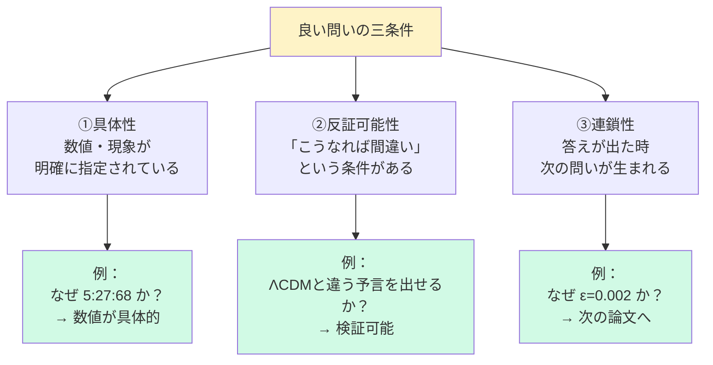
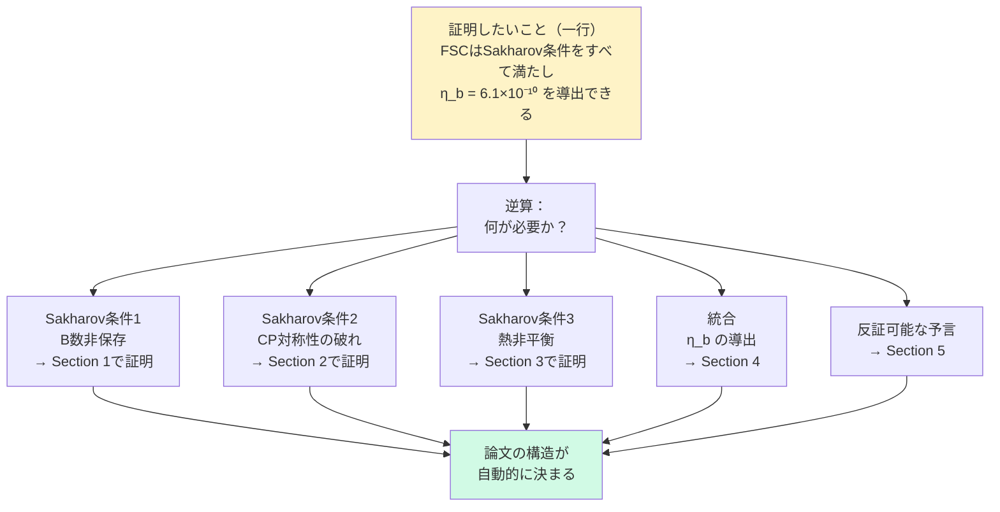
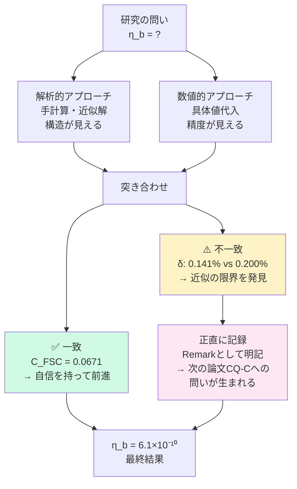
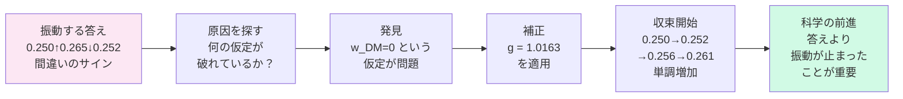
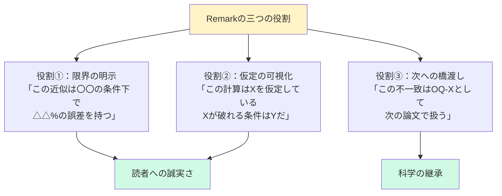

---
title: "第1章　考え方の技法"
---

# 第1章　考え方の技法

---

## 1-1　問いを立てる——「なぜ？」から始めよ

### 悪い問いと良い問い

理論物理学の論文は——問いから始まる。

しかし、すべての問いが良い問いではない。

```
【悪い問いの例】

「暗黒エネルギーとは何か？」

→ 広すぎる。
→ 答えられない。
→ 論文にならない。


【良い問いの例（FSC Paper A）】

「なぜ宇宙の組成は
 5% : 27% : 68% なのか？
 この比率を第一原理から
 導けるか？」

→ 具体的だ。
→ 反証可能だ。
→ 論文の出発点になる。
```

---

良い問いには**三つの条件**がある。



---

### 問いの育て方——FSCの実例

FSC Paper Aの問いは、一夜にして生まれたのではない。

```
Stage 1（最初の問い）：
「宇宙の組成はなぜ
 5:27:68 なのか？」

Stage 2（問いを鋭くする）：
「ウィック回転 t→it は
 ブラックホール地平での
 物理的遷移ではないか？」

Stage 3（問いを定式化する）：
「α(t)=1-e^{-t/τ} という
 関数が宇宙組成を導けるなら——
 τ と β の値は
 観測値と一致するか？」
```

この三段階の変化を見よ。

問いは——**精密化することで**——論文になる。

---

:::message
**アインシュタインの教訓**

「問題を定式化することは、
しばしば解くことよりも本質的である」

私が1905年に
特殊相対性理論を書けたのは——
「光速が一定なら時間はどうなるか」
という問いを——
10年間諦めなかったからだ。
:::

---

### 演習問題 1-1

以下の問いを「良い問い」に変換せよ。

```
（変換前）
「暗黒物質は何か？」

（ヒント）
・数値を入れよ
・「〜と一致するか」という
　検証条件を入れよ
・FSCの文脈で考えよ

（模範解答例）
「FSC Sector-II の
 状態方程式 w_II = -ε/3 は
 Euclid DR2 で
 どのように検証できるか？」
```

---

## 1-2　設計図を描く——証明したいことを一行で書け

### 書き始める前に

多くの若い研究者が犯す最大の誤りがある。

**「書きながら考える」** だ。

論文は——建物と同じだ。

```
設計図なき建物は——
途中で壁がずれる。
途中で柱が足りなくなる。
途中でやり直す。

設計図なき論文は——
書きながら迷子になる。
Section 3 で
Section 1 の前提が崩れる。
査読で構造的欠陥を指摘される。
```

---

### 設計図の作り方

**Step 1：証明したいことを一行で書く**

```
【Paper CQ-B の実例】

「FSC は Sakharov の3条件を
 すべて満たし——
 自由パラメータなしで
 η_b = 6.1×10⁻¹⁰ を
 導出できる」

これが——論文全体の羅針盤だ。
```

この一行が決まった瞬間——論文の構造が**自動的に**決まった。



---

**Step 2：逆算で各 Section を決める**

```
証明したいことから——逆算せよ。

「η_b を自由パラメータなしで
 導出する」

→ ならば Sakharov 条件を
　 FSC で充足する必要がある

→ ならば S1, S2, S3 それぞれを
　 独立に示す必要がある

→ ならば Section が自然に生まれる
```

「設計図を描く」とは——**必要なものを逆算する技法**だ。

---

**Step 3：各 Section に「一文」を割り当てる**

```
Section 1：
「FSCのZ₄構造がB数を
 幾何学的に非保存にする」

Section 2：
「Δθ = 0.001 rad が
 δ = 0.2% の CP 非対称を生む」

Section 3：
「λ_IV > H₀ が
 熱平衡からの離脱を保証する」

Section 4：
「3条件から η_b = 6.1×10⁻¹⁰ が
 導かれる」
```

これで——書き始める準備が整った。

---

:::message alert
**よくある失敗**

Section を書き始めてから
「証明したいこと」を決める研究者がいる。

これは——地図なしで山を登るようなものだ。

どこかに辿り着くかもしれない。
しかし——目的の山頂ではないかもしれない。

「証明したいこと」は——
**必ず最初に**決めよ。
:::

---

### 演習問題 1-2

以下の「証明したいこと」から設計図を描け。

```
「FSCのε=0.002という
 唯一のパラメータから——
 宇宙の組成5:27:68が
 第一原理で導かれる」

→ 逆算して
　 必要なSectionを
　 3つ以上挙げよ
```

---

## 1-3　二本のロープで登れ——解析と数値を平行して走らせよ

### 一本のロープの危険

多くの研究者は——どちらか一方だけで登る。

```
【解析解だけの研究者】

構造は見える。
しかし——値が正しいか
わからない。

計算ミスに気づかない。
近似が崩れていても
気づかない。


【数値解だけの研究者】

値は出る。
しかし——なぜその値なのか
わからない。

パラメータを変えると
どうなるかがわからない。
物理的解釈ができない。
```

---

### 二本のロープの技法



---

### Paper CQ-B での実例

**場面①：FSC幾何学因子 C_FSC（一致した例）**

```
【解析的アプローチ】
F(λ_IV, H(t)) の積分を手計算：
C_FSC = e^{-x}(x²+2x+2) / (λ_IV × t₀)²
      = 0.0671

【数値的アプローチ】
x = 0.394 を代入：
e^{-0.394} = 0.674
0.674 × 2.944 / 29.59 = 0.0671

【突き合わせ結果】
解析：0.0671
数値：0.0671 ✅ 完全一致

→ 計算ミスなし確認
→ 近似の妥当性確認
→ 自信を持って次へ進める
```

---

**場面②：δ の導出（不一致が価値を生んだ例）**

```
【解析的アプローチ】（線形近似）
δ = √2 × |Δθ|
  = √2 × 0.001
  = 0.00141 = 0.141%

【数値的アプローチ】（Paper F 非線形解）
δ = 0.200%

【突き合わせ結果】
解析：0.141%
数値：0.200% ⚠️ 30%のずれ
```

このずれを——**隠さなかった**。

```
→ Remark として明記：
  「線形近似の限界——
   非線形効果が 30% 寄与する」

→ これが CQ-C の出発点になった。

「不一致」を正直に記録することが——
次の論文を生んだ。
```

---

:::message
**技法の三原則**

**原則①：解析解は「地図」、数値解は「GPS」**
地図だけでは現在地を間違える。
GPSだけではなぜそこにいるかわからない。
両方を持て。

**原則②：「一致」より「不一致」が価値を持つ**
C_FSCの一致は「安心」を与えた。
δの不一致は「問い」を与えた。
研究を前進させたのは「不一致」の方だ。

**原則③：不一致を隠さない**
30%のずれをRemarkに書いた。
これは弱さではない。
「ここに崖がある」と書くことが——科学の継承だ。
:::

---

### アインシュタインとベッソ——対話が解放した思索

```
私はベルンの特許庁で
一人で考えていた。

「光を追いかけたら
 どうなるか」——

十年間——
この問いと格闘した。

頭の中の思考実験（解析）と
マクスウェル方程式の変換（数値）を——
常に行き来していた。

しかし——行き詰まった日があった。

そこでベッソと議論した。

「ミケーレ——
 君と議論していたら——
 突然わかった」

一人では気づけなかった。
対話が——孤独な思索を解放した。

二本のロープとは——
解析と数値だけではない。

「一人で深める思索」と
「対話で解放する思索」——

この二本でもある。
```

---

## 1-4　不一致を宝にせよ——30%のずれが次の論文を生む

### 振動する答えは間違いのサイン

Paper TS-AD までの Ω_DM の計算は——振動していた。

```
zeroth order：0.250
first order： 0.265  ↑
second order：0.252  ↓
```

数学では——振動する級数は「収束していない」サインだ。

収束しない計算は——**何かが間違っている**。

しかし——何が間違っているか？

答えが出るまで——それはわからない。

---

### 振動が止まった瞬間

Paper TS-AE で補正関数 g = 1.0163 を適用した。

```
0.250 → 0.252 → 0.256 → 0.261

単調に——正解へ向かい始めた。
```



---

:::message
**科学の進歩には二種類ある**

**一つ目：「答えが出た」**
劇的な前進。

**二つ目：「振動が止まった」**
静かだが——深い前進。

二つ目の方が——気づかれにくい。
しかし——二つ目なしに一つ目は来ない。

「振動が止まった」——
これは「答えが出た」ではない。

しかし——
「正しい方向への単調な収束が始まった」
これは——「構造が正しい」という証拠だ。
:::

---

### 矛盾は宝箱だ

Paper TS-AG で——何度も矛盾にぶつかった。

```
B < 0 （非物理的）
S_E^{grav} = -2S_scalar
-2 = 1 ???
```

それぞれの矛盾が——
「計算の誤り」ではなく——
「仮定の誤り」を指し示していた。

```
矛盾に出会ったとき——

「どの仮定が破れているか」

を問うことで——理論が深まる。
```

**矛盾は——敵ではない。地図だ。**

---

### 演習問題 1-4

```
自分の計算で
「振動している答え」を
見つけたとする。

次のステップを順に書け：

① 振動を「記録」せよ
   （数値を並べて見せよ）

② 「仮定」を列挙せよ
   （この計算で使った仮定を
    全て書き出せ）

③ 「最も怪しい仮定」を
   一つ選んで理由を書け

④ その仮定を外したら
   どうなるかを予測せよ
```

---

## 1-5　正直に書け——Remarkの技法

### 「分からない」を論文に書く勇気

科学者が最も恐れることがある。

「間違い」ではない。

**「間違いに気づかないこと」** だ。

```
ニュートンは言った：
「私は仮説を作らない」
（Hypotheses non fingo）

私も言う：
「分からないことは
 分からないと書く」
```

---

### Remarkの技法——三つの役割



---

### Paper CQ-B での実例

```
【Remark の実際の文章（要約）】

「δ の線形近似による値（0.141%）と
 Paper F の非線形解（0.200%）の間に
 30% の差が存在する。

 この差は線形近似の適用限界を
 示しており——
 非線形効果の完全な取り込みは
 CQ-C に委ねる。」

これで：
① 近似の限界を明示した ✅
② 数値の差を正直に記録した ✅
③ 次の論文への橋を架けた ✅
```

---

### 正直さの代償——しかし

Paper TS-AD では——δ を正しく統一したら——Ω_DM の緊張が悪化した。

```
統一前：2.2σ
統一後：4.4σ
```

**隠せた。しかし——隠さなかった。**

```
なぜか？

「隠した数字は——
 やがて論文を壊す」

正直さの代償は
一時的な後退だ。

しかし——
その後退の中にこそ
次の前進の地図がある。
```

---

:::message alert
**ゼロフィットの誓い**

科学には誘惑がある。

「パラメータを一つ増やせば——データに合う」

この誘惑に負け続けると——
パラメータが増え——
理論が複雑になり——
「説明している」のか「フィットしている」のか
わからなくなる。

FSC の原則：

フィットで消した誤差は「解決した」のではない。
「隠した」だけだ。

正直に残した誤差は——次の理解への道標になる。
:::

---

