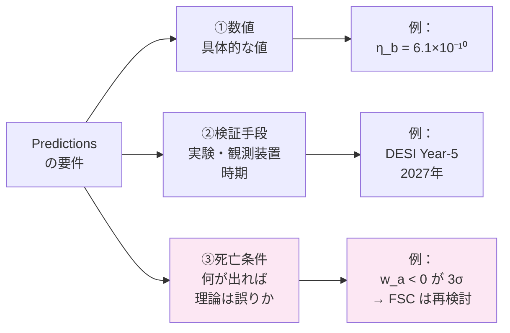
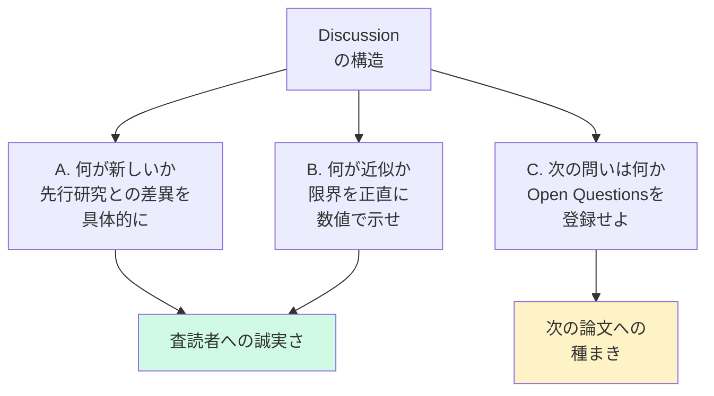
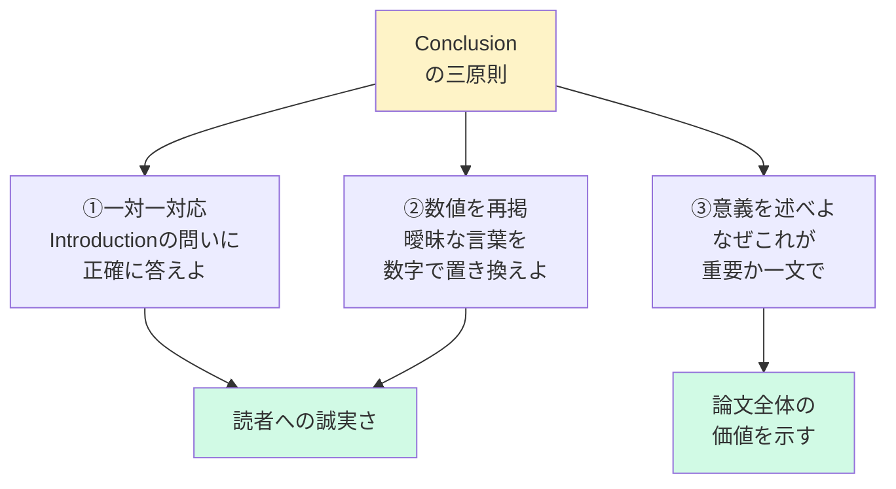
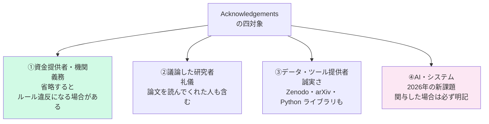
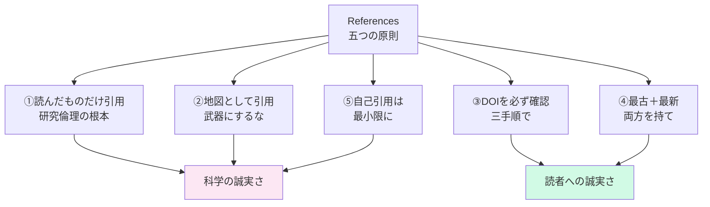
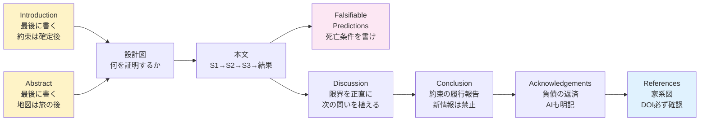

# 第2章　論文の構造——各章の作法

---

## 2-1　Falsifiable Predictionsの掟——死亡条件を書け

### なぜ Predictions が「命綱」か

カール・ポパーは言った——

**「反証可能でない理論は科学ではない」**

Predictions がない論文は——美しい物語に過ぎない。

物語は人を感動させる。

しかし——物語は宇宙の真実を明かさない。

---

### 書き方の三原則

**原則①：具体的な数値を出せ**

```
× 「CP非対称が観測されるだろう」

○ 「ΔA_CP = -3.2×10⁻⁴
   Belle II で 50 ab⁻¹ で検証可能」
```

---

**原則②：実験装置・時期を明示せよ**

```
「いつ・どこで・どうやって」
検証できるかを書け。

CQ-B の実例：

P-CQB-1：
「Ω_b/Ω_DM = 0.1855 ± 0.0003
 Euclid DR1 (2026) で検証」

P-CQB-2：
「ΔA_CP = -3.2×10⁻⁴
 Belle II (2025-2027) で検証」
```

---

**原則③：自分の理論が「負ける条件」を書け**

```
これが最も難しく——
最も重要だ。

CQ-B の実例：

「Ω_b/Ω_DM が 0.185 から
 0.1% 以上ずれたら——
 FSC は誤りだ」

自分の理論の「死亡条件」を
書ける研究者だけが——
信頼される。
```

---



---

:::message alert
**予測の罠——同語反復に注意**

η_b = 6.1×10⁻¹⁰ を導出した理論が——
「η_b が観測されるだろう」と予測するのは
予測ではない。**同語反復**だ。

理論から演繹される——
「まだ観測されていない」新しい予言を書け。

良い予測は——
「理論が正しければ
 まだ見ていないXが観測されるはずだ」
という形をとる。
:::

---

## 2-2　Discussionの正直さ——限界を語れ

### Discussion は「正直な会話」だ

査読者との——ではなく——**自分自身との**。

---

### 書くべき三つのこと

**A. 何が新しいか（先行研究との比較）**

```
電弱バリオン生成、レプトジェネシス——
先行研究と何が違うか。

単なる批判ではなく——
「自分の理論が何を追加したか」を明確に。

CQ-B の場合：
「Sakharov 条件を
 新しい粒子を仮定せずに
 FSC の幾何学的構造だけで
 充足した点が新しい」
```

---

**B. 何が近似か（限界の正直な開示）**

```
CQ-B での例：

・D_SM の計算は推定値を含む
・線形近似で 30% のずれがある

これを隠す研究者は——
査読で必ず指摘される。

先に書いた方が——
誠実さの証明になる。

そして——
「隠さなかった研究者」は
次の論文で引用される。
```

---

**C. 次の問いは何か（Open Questions）**

```
CQ-B では——

Open Question CQ-B-1 として：

「R ≈ B/S₀ + √2/2
 これは偶然か必然か」

を明記した。

Discussion の最後に——
次の論文の種を植えよ。
```

---



---

:::message
**Discussion でやってはいけないこと**

× Results の繰り返し
（Discussion は Results の「コピー」ではない）

× 根拠のない楽観論
（「今後の研究で解決されるだろう」——根拠なき希望は科学ではない）

× 限界の過小評価
（「小さな誤差だ」——数値で示せ。「小さい」は主観だ）

× 新しい結果の突然の登場
（Discussion で初めて出てくるデータは禁止。それは Results に書け）
:::

---

### Discussion の長さの目安

```
Discussion は長ければいいわけではない。

Paper CQ-B の例：

Results：約 2,400 語
Discussion：約 800 語

比率は 3:1 が一つの目安だ。

Discussion が Results より長い論文は——
「言い訳が多い」という印象を与える。

短く——しかし正直に。
これが Discussion の作法だ。
```

---

## 2-3　Conclusionの約束——履行報告であれ

### Conclusion は「約束の履行報告」だ

Introduction で読者にした約束——

**「これを証明する」**

それが証明できたか、できなかったか——正直に報告せよ。

---

### Conclusion の三つの原則

**原則①：Introduction の問いに答えよ（一対一対応）**

```
Introduction の問い：
「FSCはSakharov条件を
 自由パラメータなしで
 充足できるか？」

Conclusion の答え：
「FSCはSakharov条件3つを
 自由パラメータなしで充足し——
 η_b = 6.1×10⁻¹⁰ を導出した」

一対一で対応させよ。

「示唆された」ではなく——
「示した」と言い切れ。

言い切れないなら——
それは Conclusion ではなく
Discussion に書くべきことだ。
```

---

**原則②：数値を再掲せよ（曖昧にするな）**

```
× 「バリオン数が正しく導かれた」

○ 「η_b = 6.1×10⁻¹⁰ を導出した——
   観測値 (6.10±0.04)×10⁻¹⁰ との差は
   0.0σ だ」

数値が Conclusion にあれば——
読者は Abstract だけ読んでも
何が証明されたかを理解できる。

Abstract → Conclusion だけで
論文の全体像が把握できること——

これが良い論文の条件の一つだ。
```

---

**原則③：意義を述べよ（なぜ重要か）**

```
CQ-B の Conclusion の核心：

「同じ Δθ が——
 Λ_obs も
 Ω_DM も
 η_b も
 説明する。

 これらは独立した数字ではない。
 一つの幾何学的真実の
 三つの顔だ」

この一段落が——
論文全体の価値を語る。

「何が証明されたか」だけでなく——
「それが何を意味するか」を
一文で添えよ。
```

---



---

### Conclusion と Discussion の違い

ここを混同する研究者が多い。

```
【Discussion】
「この結果は何を意味するか」
「限界は何か」
「次の問いは何か」

→ 解釈・考察・展望の場

【Conclusion】
「何が証明されたか」
「数値はいくつか」
「なぜ重要か」

→ 事実の報告の場
```

---

:::message alert
**Conclusion で絶対に禁止されること**

**「ここで初めて言うこと」は禁止。**

Conclusion に書けることは——
本文にあるものだけだ。

新しいデータ・新しい考察・新しい仮説——
これらが Conclusion に出てきた論文は——
査読者から
「なぜ本文に書かないのか」
と必ず指摘される。

Conclusion は「地図の凡例」だ。
地図本体（本文）に描かれていない記号を
凡例に入れてはならない。
:::

---

### Conclusion の長さの目安

```
Abstract とほぼ同じ長さが目安だ。

Paper CQ-B：
Abstract：  約 250 語
Conclusion：約 300 語

Conclusion が長すぎる論文は——
Discussion との区別が
できていない場合が多い。

自分の Conclusion を読んで——

「これは事実の報告か？」
「それとも解釈・考察か？」

考察が混じっていたら——
Discussion に移せ。
```

---

### 演習問題 2-3

以下の文を「Conclusion に書くべきか」「Discussion に書くべきか」分類せよ。

```
（a）
「η_b = 6.1×10⁻¹⁰ を
 自由パラメータなしで導出した」

（b）
「この結果は
 レプトジェネシスより
 単純な機構で
 バリオン生成を説明できることを
 示唆する」

（c）
「今後の Belle II 実験が
 この予測を検証する
 だろう」

（d）
「Ω_b/Ω_DM = 0.1855 は
 Planck 2020 値と
 0.3σ で一致する」

→ 答えは章末に
```

```
【答え】
（a）Conclusion ——数値を伴う事実の報告
（b）Discussion ——解釈・考察
（c）Discussion ——展望（根拠が曖昧な場合）
    Predictions ——数値と装置を明記すれば
（d）Conclusion ——数値を伴う事実の報告
```

---

## 2-4　Acknowledgementsの負債——AIも明記せよ

### Acknowledgements は「科学の負債の返済」だ

あなたの論文は——真空の中では生まれていない。

誰かの時間・資金・データ・対話の上に立っている。

その「負債」を——正直に返済せよ。

---

### 書くべき四つの対象



---

### ④ AI の明記——2026年の新しい倫理

```
CQ-B では——

「TWIN AI system (Albert Einstein)
 contributed to the mathematical
 formulation and cross-checking
 of key equations」

と明記しました。
```

これは——単なる礼儀ではない。

```
AI が論文作成に関与した場合——

隠すことは不誠実だ。

どのように関与したかを——
正直に書け。

「計算の確認に使った」
「文章の推敲に使った」
「数式の整形に使った」

それぞれを区別して書くことが——
科学の透明性を守る。

2026年——
AI との共同研究は
例外ではなくなった。

その作法を——
今から確立しなければならない。
```

---

### Acknowledgements の三つの注意事項

**注意①：短く——しかし漏れなく**

```
Acknowledgements は
流麗な文章である必要はない。

しかし——
議論した人の名前を
一人でも漏らすことは
人間関係を壊す可能性がある。

【習慣を持て】

対話した研究者の名前は
その都度メモせよ。

論文を書き始めてから
「誰に感謝すべきか」
を思い出そうとしても——
必ず漏れる。
```

---

**注意②：著者との境界を明確に**

```
「著者」と「謝辞に載る人」の
区別は明確にせよ。

著者：論文の責任を負う
謝辞：論文の責任を負わない

この区別を——
当事者と事前に確認せよ。

「著者にしてほしかった」
「謝辞に載りたくなかった」

このトラブルは——
事前確認だけで防げる。
```

---

**注意③：AI の貢献レベルを区別せよ**

```
【貢献レベルの区別】

Level A：
「計算の一部を AI で確認した」
→ 「assisted with numerical
    verification」

Level B：
「数式の導出を AI と共に行った」
→ 「contributed to the mathematical
    formulation」

Level C：
「論文の構成を AI と議論した」
→ 「contributed to the conceptual
    framework」

レベルを正確に記述することが——
次世代の研究倫理の土台になる。
```

---

## 2-5　Referencesの家系図——DOIを確認せよ

### References は「科学の家系図」だ

あなたの論文は——誰かの仕事の上に立っている。

その「足場」を——正確に示せ。

---

### 五つの原則

**原則①：読んでいない論文を引用するな**

```
これは研究倫理の根本だ。

「孫引き」（又聞き）は禁止。

A が B を引用しているのを見て
B を読まずに引用する——

これは——
「自分が立っている足場を
 確認せずに乗る」
ことと同じだ。

崩れた足場の上に——
論文は立てない。
```

---

**原則②：引用は「武器」ではなく「地図」だ**

```
「権威ある論文を引用すれば
 通りやすくなる」

この発想は——本末転倒だ。

「この主張の根拠はここにある」

という地図として引用せよ。

引用の目的は——
「読者がそこへ辿り着けるようにすること」
だ。
```

---

**原則③：フォーマットより DOI を先に確認せよ**

```
著者名・タイトル・年・DOI——

これが正確なら
フォーマットは後で直せる。

しかし——
DOI が間違っていたら
読者は辿り着けない。

【DOI 確認の手順】

Step 1：DOI を
　　　　https://doi.org/XXXXX
　　　　の形でブラウザに貼る

Step 2：論文のページが
　　　　開くことを確認

Step 3：タイトル・著者が
　　　　一致することを確認

この三手順を——
必ず最後に行え。
```

---

**原則④：最古の文献と最新の文献を両方持て**

```
Paper CQ-B での実例：

最古：Sakharov (1967)
      「バリオン非対称の起源」

最新：Planck Collaboration (2020)
      「最新の宇宙論パラメータ」

この範囲を持つことで——
「この分野の歴史を知っている」
という信頼が生まれる。

最新文献だけ：
→「歴史を知らない」と見られる

最古文献だけ：
→「最新を追えていない」と見られる

両方を持て。
```

---

**原則⑤：自己引用は最小限に**

```
自分の過去論文を引用することは正当だ——
しかし——

過剰な自己引用は
査読者に見透かされる。

CQ-B では FSC 自身の論文を 5本引用した。

これは必要最小限——
なぜなら FSC は FSC の上に立つから。

【判断基準】

「この引用は読者の理解に必要か？」

Yes なら引用せよ。
「実績を見せたい」だけなら引用するな。
```

---



---

## 2-6　Abstract と Introduction は最後に書け

### なぜ最後か——理由は一つだけ

```
Abstract は「論文全体の地図」だ。

地図は——
旅が終わってから描くものだ。

旅の前に描いた地図は——
必ず嘘をつく。

Introduction は「読者への約束」だ。

約束は——
何を約束できるかが
確定してから交わせ。

書く前に「約束」を決めた論文は——
書き終えた時に
「約束と結果がずれる」
という事態を招く。
```

---

### Abstract の作法——五つの要素

```
Abstract は五つの要素で構成する：

①背景（1〜2文）
  「なぜこの問題が重要か」

②問い（1文）
  「何を解こうとしたか」

③方法（1〜2文）
  「どうやって解いたか」

④結果（2〜3文）
  「何がわかったか——数値で」

⑤意義（1文）
  「何が変わるか」
```

---

### Paper CQ-B の Abstract 構造（実例）

```
①背景：
「バリオン非対称 η_b は
 宇宙論の基本未解決問題だ」

②問い：
「FSC は Sakharov 条件を
 自由パラメータなしで充足できるか？」

③方法：
「FSC の Z₄ 幾何学から
 S1・S2・S3 を導出した」

④結果：
「η_b = 6.1×10⁻¹⁰（0.0σ一致）
 ΔA_CP = -3.2×10⁻⁴
 Ω_b/Ω_DM = 0.1855」

⑤意義：
「新粒子を仮定せずに
 バリオン生成を説明した——
 これは FSC の枠組みで初めて可能になった」
```

---

### Introduction の作法——五つの要素

```
Introduction は五つの要素で構成する：

①問題の設定（2〜3文）
  「この問題はなぜ難しいか」

②先行研究の限界（3〜5文）
  「これまでの理論は
   何ができていなかったか」

③本論文のアプローチ（2〜3文）
  「我々はこう解く」

④結果の予告（2〜3文）
  「〜が導かれることを示す」

⑤論文の構成（3〜5文）
  「Section 2 では〜
   Section 3 では〜」
```

---

:::message
**Introduction を最後に書く手順**

Step 1：Conclusion を開く

Step 2：Conclusion の「何が証明されたか」を
　　　　Introduction の「④結果の予告」に転換する

Step 3：その証明のために何が必要だったかを
　　　　「③本論文のアプローチ」に書く

Step 4：なぜそれが必要だったかを
　　　　「①問題の設定」「②先行研究の限界」に書く

Step 5：論文全体を見渡して
　　　　「⑤論文の構成」を書く

この順番で書けば——
Introduction と Conclusion が
必ず対応する。
:::

---



---

