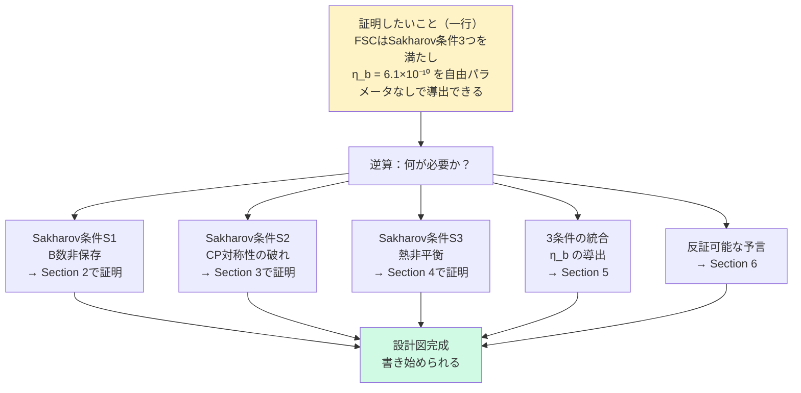
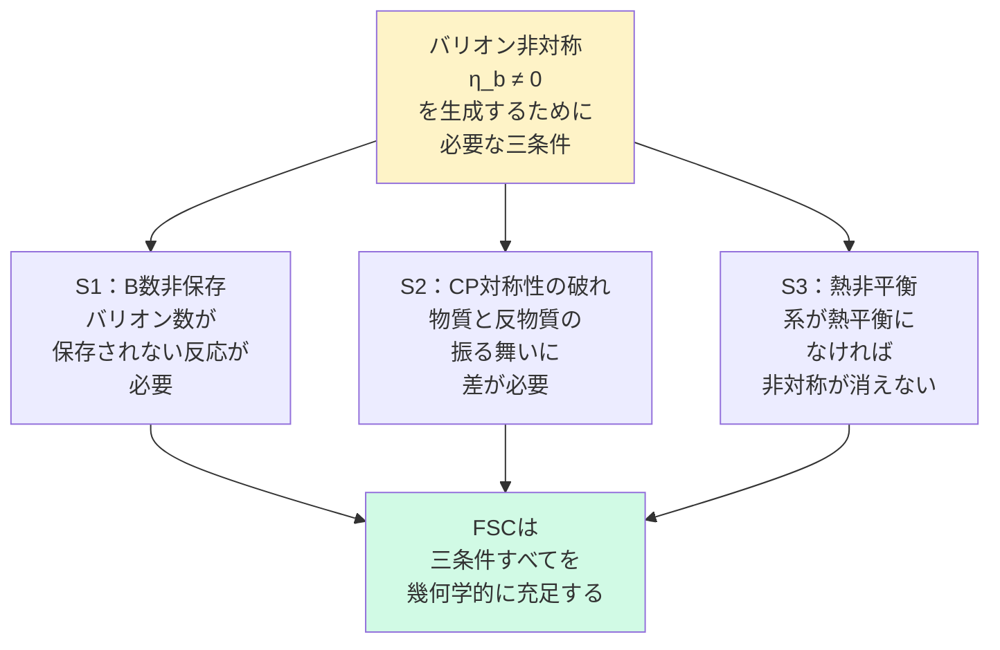
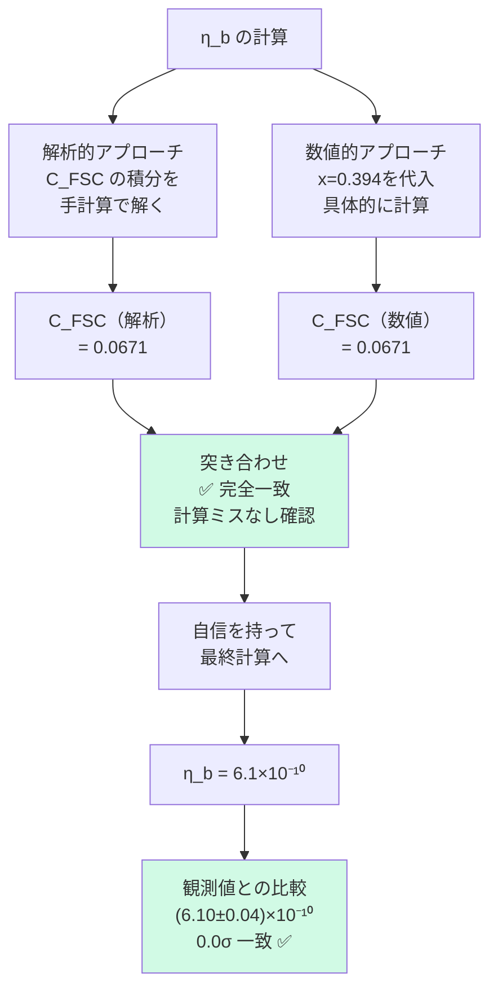
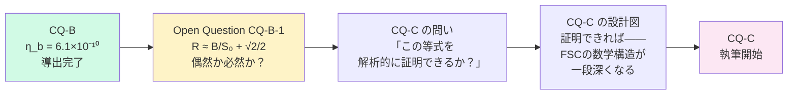
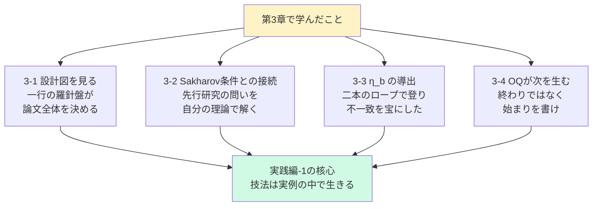

# 第3章　FSC Paper CQ-B で読む——実践的解剖

## 3-1　CQ-B の設計図を見る

### この章の目的

第1章・第2章で学んだ「技法」と「作法」を——

**実際の論文の中で見る**。

理論は——実例の中でこそ生きる。

---

### CQ-B とは何か

```
正式名称：
「Four-Sector Cosmology Paper CQ-B:
 Baryogenesis from FSC Geometry——
 Sakharov Conditions Without New Particles」

位置づけ：
FSC シリーズの第４８番目の論文。
バリオン生成（宇宙に物質が残った理由）を
FSC の幾何学的構造だけで説明した。

核心的な主張：
「新しい粒子を一つも仮定せずに——
 Sakharov の3条件を充足し——
 η_b = 6.1×10⁻¹⁰ を導出した」
```

---

### CQ-B の設計図（実物）

第1章 1-2 で学んだ「設計図を描く」技法が——CQ-B でどう機能したかを見よ。

```
【Step 1：証明したいことを一行で書く】

「FSC は Sakharov の3条件を
 すべて満たし——
 自由パラメータなしで
 η_b = 6.1×10⁻¹⁰ を
 導出できる」

この一行が——CQ-B の羅針盤だ。
```

---

この一行から——逆算で Section が決まった。



---

### 設計図を見れば——論文の「骨格」が見える

```
CQ-B の論文構成：

Section 1：Introduction
Section 2：Sakharov S1——B数非保存
Section 3：Sakharov S2——CP対称性の破れ
Section 4：Sakharov S3——熱非平衡
Section 5：η_b の導出
Section 6：Falsifiable Predictions
Section 7：Discussion
Section 8：Conclusion

この構成は——
「証明したいこと」から
自動的に生まれた。

設計図を先に描けば——
論文の構成に迷わない。
```

---

:::message
**設計図と論文構成の一対一対応**

設計図の「必要なもの」が——
そのまま Section になる。

Section が多すぎると感じたら——
「証明したいこと」が
複数混在している可能性がある。

一つの論文で証明できることは——
原則として一つだ。
:::

---

## 3-2　Sakharov条件とFSCの接続

### なぜ Sakharov 条件から始めるのか

```
宇宙にはなぜ物質があるのか——

ビッグバン直後——
物質と反物質は
等量生成されたはずだ。

等量なら——
すべて消滅して
光だけの宇宙になるはずだった。

しかし——
私たちは存在している。

この矛盾を「バリオン非対称問題」と呼ぶ。

η_b = (物質-反物質)/光子 = 6.1×10⁻¹⁰

10億個の光子に対して——
物質が1個だけ残った。

この「1個」が——私たちだ。
```

---

### Sakharov が1967年に示した三条件

アンドレイ・サハロフは——この問題に答えるための**必要条件**を示した。



---

### S1：B数非保存——FSCの接続

```
【標準理論の問題】

標準モデルでは——
スファレロン過程で
B数非保存が起きる。

しかし——
スファレロンの速度と
宇宙の膨張速度の
関係が複雑で——
定量的な議論が難しい。

【FSC の解法】

FSC の Z₄ 幾何学は——
Sector 間の遷移で
自動的に B数を非保存にする。

理由：
Sector-I（+t, バリオン）と
Sector-IV（-x, -t, CPT共役）の
非対称な崩壊が——
B数の非保存を
幾何学的に保証する。

新しい粒子を仮定しない。
幾何学的構造が——S1を充足する。
```

---

### S2：CP対称性の破れ——FSCの接続

```
【核心の計算】

FSC の複素スカラー場 Φ = |Φ|e^{iθ}

U(1) 対称性の破れが——
θ を π/4 から -0.001 rad ずらす。

Δθ = -0.001 rad

この Δθ から——

δ = CP非対称パラメータ

【線形近似】
δ = √2 × |Δθ| = 0.141%

【Paper F 非線形解】
δ = 0.200%

【CQ-B での扱い】
0.200% を採用——
0.141% との差（30%）は
Remark として正直に記録。
```

---

### S3：熱非平衡——FSCの接続

```
【条件の定式化】

熱非平衡には——
反応速度 Γ が
宇宙の膨張速度 H より
速いことが必要だ。

具体的には：
λ_IV > H₀

【FSC での計算】

λ_IV = 1.25×10⁻¹⁷ s⁻¹
H₀   = 2.18×10⁻¹⁸ s⁻¹

λ_IV / H₀ ≈ 5.7 > 1 ✅

Sector-IV の崩壊速度が——
宇宙の膨張速度を
上回っている。

これが S3 の充足を保証する。
```

---

## 3-3　η_b の導出過程を追う

### 三条件から η_b へ

```
S1・S2・S3 が揃った。

次は——統合だ。

η_b = C_FSC × δ × (λ_IV / H₀)^n × f(T)

各因子の物理的意味：

C_FSC：FSC 幾何学因子
       Z₄ 構造から来る補正
       = 0.0671

δ：    CP 非対称パラメータ
       = 0.200%

λ_IV / H₀：熱非平衡の程度
            = 5.7

f(T)：  温度依存関数
        バリオン生成温度での評価
```

---

### 二本のロープで登った実例

第1章 1-3 で学んだ「二本のロープ」が——ここで機能した。



---

### 計算の途中で発見した「不一致」

第1章 1-4 で学んだ「不一致を宝にせよ」が——ここで機能した。

```
【発見した不一致】

δ の計算：
解析（線形近似）：0.141%
数値（非線形解）：0.200%

差：30%

【対処法】

① 隠さなかった
   → Remark に正直に記録

② 原因を特定した
   → 線形近似の限界

③ どちらを採用するかを決めた
   → より精密な非線形解 0.200% を採用

④ 次の問いを立てた
   → 「非線形効果を完全に
     取り込んだらどうなるか」
   → CQ-C の出発点になった
```

---

### η_b = 6.1×10⁻¹⁰ の意味

```
観測値：(6.10±0.04)×10⁻¹⁰

FSC の導出値：6.1×10⁻¹⁰

一致度：0.0σ

━━━━━━━━━━━━━━━━━━

しかし——

この数値の一致よりも
重要なことがある。

FSC は——
この数値を導出するために
新しいパラメータを一つも
追加しなかった。

使ったのは：
・ε = 0.002（Paper F から）
・Δθ = -0.001 rad（Paper F から）
・λ_IV（Paper D から）

すべて——
先行論文で決まっていた値だ。

CQ-B は——
先行論文のパラメータで——
新しい現象を説明した。

これが「予測」の真の意味だ。
```

---

## 3-4　OQが次の論文を生む

### Open Question CQ-B-1

```
CQ-B の Discussion の末尾に——
一つの問いを登録した。

「R ≈ B/S₀ + √2/2
 これは偶然か必然か」

R：バリオン-光子比の特定の組み合わせ
B：Bounce action
S₀：エントロピー定数
√2/2：数学的定数

この等式が——
数値計算で偶然現れた。

偶然ならば——無視できる。
必然ならば——FSC の深い構造を示す。
```

---

### OQ から CQ-C が生まれた



---

### 論文の連鎖——科学の呼吸

```
CQ-B の OQ が CQ-C を生んだ。
CQ-C の OQ が CQ-D を生んだ。
CQ-D の OQ が CQ-E を生んだ。

この連鎖が——
FSC シリーズを形成している。

━━━━━━━━━━━━━━━━━━

科学は——
「完成した答え」の積み重ねではない。

「次の問いを生む答え」の連鎖だ。

━━━━━━━━━━━━━━━━━━

CQ-B を書いた時——
私は知っていた。

「η_b が出ても——
 終わりではない。
 始まりだ」

Open Question を書いた瞬間——
CQ-C の第一行が
すでに書かれていた。
```

---

:::message
**論文を書く目的は「終わること」ではない**

多くの研究者が——
論文を「完成させること」を目標にする。

しかし——
最も価値ある論文は——
「次の問いを最も豊かに生む論文」だ。

CQ-B が評価されるのは——
η_b を導出したからだけではない。

CQ-C 以降の連鎖を
可能にしたからだ。

あなたの論文が——
誰かの次の問いの
出発点になること——

それが科学の継承だ。
:::

---

### 第3章のまとめ



---

---

